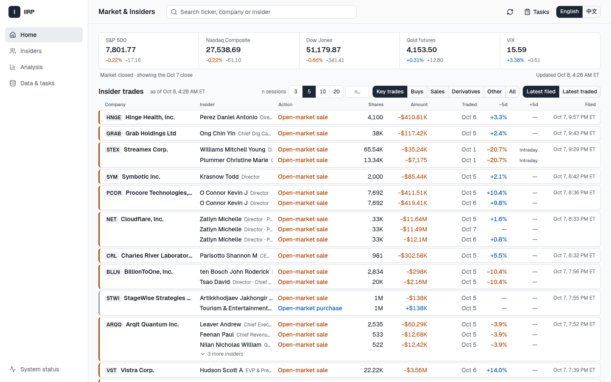
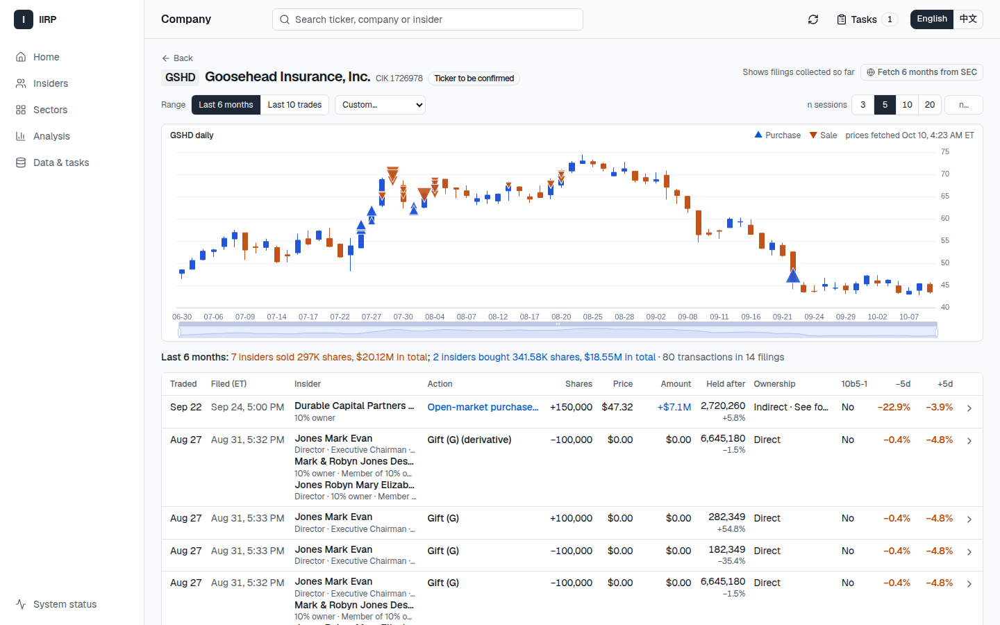
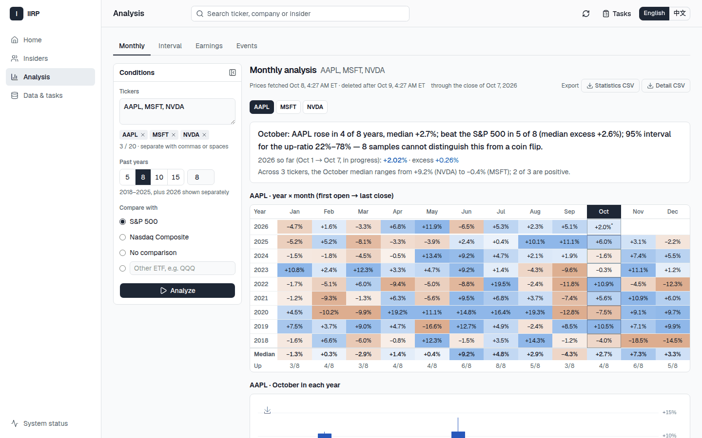
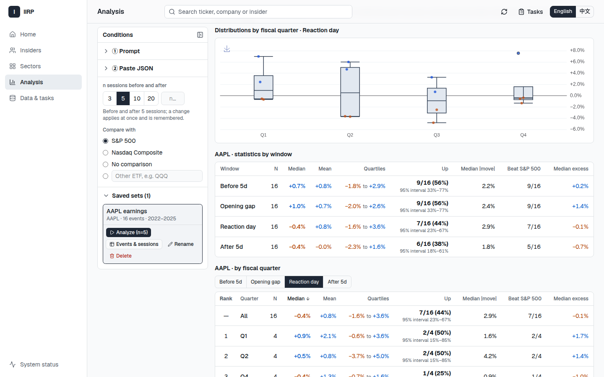
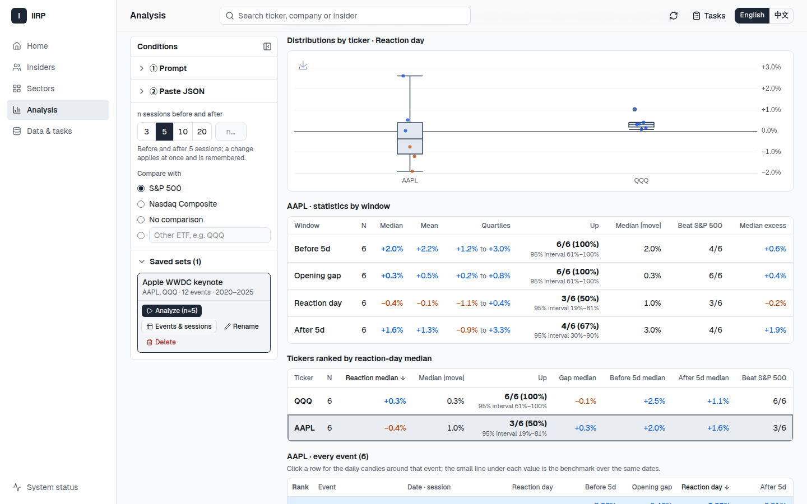

# IIRP

[English](README.md) · **中文**

IIRP 是一个在自己电脑上运行的美股个人研究工具。它采集 SEC 内部人交易申报和行情日线，清楚地展示出来，供你自己研究：

- **Insider 交易**：SEC 一发布 Form 3/4/5 就出现在实时信息流里；可按 ticker 或名字查询（默认最近 6 个月，可切到最近 10 笔），并显示每笔交易前后若干个交易日的涨跌。
- **板块**：用 SPDR 板块 ETF 看标普 500 的 11 个板块今日、1 周、1 个月、3 个月和年初至今的涨跌，可切换数字表、热力图和纵向 K 线。
- **价格分析**：月度规律、任意跨年区间，以及财报或任何你指定的事件前后的价格反应。

软件不给交易打分、不给信号，也不提供投资建议。数据和设置只留在你的电脑上。



## 快速开始

需要 [Docker](https://docs.docker.com/get-docker/)（Linux 用 Docker Engine 与 Compose v2，macOS 用 Docker Desktop）、Python 3（只用标准库）和 git。Windows 请在 WSL2 中运行，并把项目放在 Linux 文件系统里（例如 `~` 下，不要放在 `/mnt/c`）。

```bash
git clone https://github.com/565740807/IIRP.git iirp
cd iirp
./iirp start
```

第一次运行会构建镜像（几分钟），从 `deploy/.env.example` 生成 `deploy/.env`（只有你能读，内含随机数据库密码），然后启动 PostgreSQL、网页服务和后台 worker。之后打开 <http://127.0.0.1:18081>。

**填写 SEC 联系信息。** SEC 要求自动访问的工具提供名字和真实邮箱。填写之前，首页顶部会提示，软件也不会向 SEC 发任何请求。点击 **填写 SEC 联系信息**，输入名字和邮箱，一分钟内 Insider 申报开始更新。它只保存在本机数据库，只发给 SEC。（也可以写在 `deploy/.env` 的 `IIRP_SEC_USER_AGENT`，例如 `Jane Doe jane.doe@your-mail.com`；配置文件优先，界面上会显示“由配置文件设定”。）

之后会发生什么：worker 跟踪 SEC 的新申报（交易日每一两分钟一次），并回补最近 6 个月的 Form 3/4/5，约 7.5 万份申报、3GB，按软件使用的礼貌速率（每秒最多 2 次请求）大约需要一天。首页的指数行情在页面打开时刷新。每项自动更新都可以在 **数据与任务 → 自动更新** 里关闭。

常用命令：

```bash
./iirp status    # 查看运行状态
./iirp stop      # 停止；数据保存在 Docker 卷里
./iirp start     # 再次启动（git pull 之后也用它升级）
./iirp backup    # 数据库和已保存申报原文的一致备份
```

页面只监听 `127.0.0.1:18081`。要换端口，在 `deploy/.env` 里设置 `IIRP_HTTP_PORT`。界面默认英文，右上角可切换中文。

## 使用说明

### Insider 交易



- **首页**：新申报从顶部滑入。每张卡片是一家公司在一个披露日的申报；每行是一位 Insider：职务、做了什么（SEC 的说法）、股数、金额和交易日。买入为蓝色带 `+`，卖出为橙色带 `−`。向下阅读时列表不动，顶部出现“↑ N new trades”按钮。
- **Insiders**：输入 ticker 或人名查询。本地没有时会去 SEC 查找，并只下载这家公司或这个人在范围内的申报。默认范围是最近 6 个月，可切到最近 10 笔或自定义。
- **公司页和人员页**：日 K 线上标出 Insider 买入（▲）和卖出（▼），下面是交易表，以及每笔交易前后 n 个交易日的涨跌（n 可选 3、5、10、20 或自定义，默认 5）。每笔交易可打开详情和 SEC 原文。

### 板块

首页指数行情条下按今日涨跌列出标普 500 的 11 个板块。**板块**页用 SPDR 板块 ETF（XLK、XLV、XLF、XLY、XLP、XLC、XLI、XLE、XLB、XLU、XLRE，对应关系在 `config/sector-map.toml`）显示今日、1 周、1 个月、3 个月和年初至今的涨跌，并写明每个周期对比的收盘日；可在可排序的数字表、热力图和统一时间范围的日/周/月 K 线之间切换，勾选板块后直接打开月度或区间分析。这些 ETF 代表标普 500 的对应板块，不覆盖全部美股。

### 分析中心



- **月度**：最多 20 只股票、过去 n 年（默认 8 年加今年），每个月从首个交易日开盘到最后一个交易日收盘的涨跌。结果有年份 × 月份热力表、每年一根 K 线，以及每个月的中位数、上涨年份比例及其 95% 区间、跑赢基准（默认标普 500）的次数。
- **区间**：任意日期区间的同样统计，例如 12 月 15 日 → 1 月 10 日，可以跨年。
- **财报**与**事件**：软件不猜日期，而是给你一段提示词，你拿去问任意 AI 助手，再把它返回的简短 JSON 贴回来：

  1. 填写股票代码（事件另填一句描述，例如 “Apple WWDC keynote”），点 **复制提示词**。提示词模板可以修改，也可以恢复默认。
  2. 把提示词贴到你常用的 AI 助手里，复制它返回的 JSON。
  3. 把 JSON 贴回 IIRP。粘贴时自动校验，问题逐条写明第几条、哪个字段。点 **保存并分析**。

  ```json
  {"events": [
    {"ticker": "AAPL", "date": "2025-10-30", "session": "after_close",
     "name": "FY2025 Q4 earnings", "fiscal_year": 2025, "fiscal_quarter": 4},
    {"ticker": "AAPL", "date": "2025-06-09", "session": "during",
     "name": "WWDC 2025 keynote"}
  ]}
  ```

  `session` 为 `before_open`（开盘前）、`during`（交易时段内）、`after_close`（收盘后）或 `unknown`。收盘后发布的消息在下一个交易日才有反应，所以结果以“反应日”为中心：事前 n 日、反应日本身（另列开盘跳空）、事后 n 日，各给中位数、四分位和上涨比例，并画出每个事件的反应日 K 线和平均路径。





结果可导出 CSV，图表可存为 PNG。每只股票的日线按整个区间一次取完，保存 24 小时；之后连同由它算出的结果一起删除，再次打开会重新获取。

## 数据来源与条款

- **SEC EDGAR**：Insider 申报来自 SEC 公开的 EDGAR 系统。请阅读 SEC 的[访问说明](https://www.sec.gov/search-filings/edgar-search-assistance/accessing-edgar-data)：自动访问必须表明身份，IIRP 的请求频率远低于 SEC 的上限。
- **行情**通过开源库 [yfinance](https://github.com/ranaroussi/yfinance) 读取 Yahoo Finance 的公开接口。yfinance **不是 Yahoo 的官方产品**，与 Yahoo 无关；数据受 Yahoo 服务条款约束，仅供个人研究，可能延迟、缺失或被更正。
- IIRP 不提供投资建议，也不保证任何数据准确、完整或及时。

## 安全与隐私

- IIRP 只监听 `127.0.0.1`，**没有登录保护**。不要把它暴露到公网或局域网；需要从别的电脑访问时用 SSH 隧道。
- 所有数据都保存在本机的 Docker 卷里（`iirp2_postgres-data`、`iirp2_app-runtime`）：申报、行情、你的事件列表、提示词模板、SEC 联系信息和备份。对外发送的只有 SEC 联系信息（每次请求 SEC 时）和股票代码（请求 Yahoo 时）。
- `deploy/.env` 里有数据库密码，已被 git 忽略，不要分享。

## 工作原理

```
浏览器 ──► web（FastAPI）──► PostgreSQL ◄── worker ──► SEC EDGAR / Yahoo（yfinance）
            只读本地数据          ▲            取数、解析、计算
                                  └── 申报原文、备份（Docker 卷）
```

网页服务只读本地数据库；所有取数都是由 worker 执行的持久任务，关闭浏览器不影响。金融计算全部在 Python 后端完成，React 前端只展示结果。详见[架构说明](docs/ARCHITECTURE.zh-CN.md)、[安装与运行手册](docs/RUNBOOK.zh-CN.md)；接口见 [docs/openapi.json](docs/openapi.json)。

## 开发

```bash
./iirp check             # Ruff、后端测试、OpenAPI、前端测试与构建
./iirp test tests/sec    # 运行部分后端测试
./iirp frontend npm test # 前端测试
```

测试和工具都在容器里运行；后端测试使用 tmpfs 中的临时 PostgreSQL，从不连接正在运行的实例的数据库。开发约定见 [AGENTS.md](AGENTS.md)。

## 许可

[MIT](LICENSE)。第三方组件保留各自的许可证，见[第三方声明](THIRD_PARTY_NOTICES.md)。
