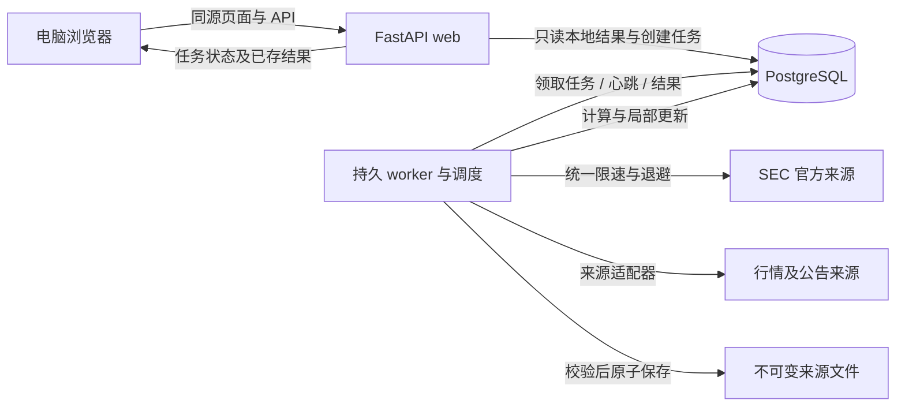

# 新 IIRP V1：完整产品、UI/UX 与技术实施规划

版本：1.0 · 编写日期：2026-09-06（美国太平洋时间）  
用途：放入新项目的 `docs/PRODUCT_AND_IMPLEMENTATION_PLAN.zh-CN.md`，作为产品、设计、开发和验收的共同依据。  
交付性质：**规划文档。本轮未创建应用、启动采集、迁移数据库或修改旧 IIRP。**

阅读导航：第 0–4 章看范围、使用流程与审美；第 5–9 章看首页、Insider 和双时间价格；第 10–14 章看分析中心及行情；第 15–21 章看采集、架构和运行；第 22–25 章用于安排开发和逐项验收。

## 0. 项目要做到什么

**让用户快速看清大盘和 Insider 的实际交易行为，再用可核对的历史股价自己判断下一步。**

打开首页，应当马上知道市场最近怎样、出现了哪些新申报；点击公司或 Insider，应当马上看到已有历史，缺少的部分在后台补齐；进入分析中心，应当可以比较历年同月、同一月日区间和同一财季公告前后的股价。

界面简单，是因为信息有层级、默认值合理、后台工作清楚，不是因为省略关键日期、隐藏缺失数据或用一个不透明分数替用户判断。

本文已经选定 V1 的默认行为。未明确由用户逐项指定的数值、配色、技术栈、时段及容量，是本规划采用的实施默认值，可在对应设置里调整；开发者不需要再次询问普通实现细节。更换数据供应商、购买服务、扩展产品范围或公开部署，属于另行决定的事项。

### 0.1 第一版必须包含

| 模块 | V1 交付内容 |
|---|---|
| 首页 | 大盘行情、最新 Insider 聚合信息流、采集状态、立即获取与暂停自动获取 |
| Insider 专页 | 完整信息流、搜索筛选、公司聚合、人员展开、明确的新申报与历史回补区别 |
| 公司详情 | 默认最近 3 个月交易，或最近 X 条交易明细；选交易查看两个时间基准的股价 |
| Insider 详情 | 同一申报主体跨公司历史、公司筛选、最近 3 个月或最近 X 条交易明细 |
| 交易详情 | 实际交易日期与 SEC 接受时间、普通股/衍生品含义、前后 5 个交易日价格、原始证据 |
| 分析中心 | 独立的月度分析、历年同期区间分析、同财政季度财报行情分析；单个及多个 ticker |
| 数据与任务 | 自动调度、立即获取、暂停/恢复、取消任务、逐项进度、重试、覆盖范围、来源设置 |
| 基础可靠性 | 持久任务、断点续作、幂等去重、修订处理、数据版本、备份恢复、可见错误与部分结果 |

### 0.2 第一版不做

自动下单、跟单执行、投资评分、胜率预测、选股推荐、复杂回测、AI 自动投资结论、新闻聚合、社交、多用户 SaaS、通知渠道集成、完整财务三表分析、全市场历史期权行情和期权盈亏模拟，均不纳入 V1。

这里的“财报分析”指 **同财季公告前后的历史股价表现**。这里的“期权交易”指 **SEC 披露的 Insider 期权及其他衍生证券行为**，不是交易所全部期权成交。不能用这两个同名概念替换用户真正要的功能。

### 0.3 不可改变的产品约定

1. 分析中心不依赖 Insider 是否有数据；二者共享行情，业务含义独立。
2. “最新”默认按 SEC 接受时间排列，不按本机下载时间排列。
3. 实际交易日、SEC 接受时间、系统首次发现时间分别存储和显示。
4. 没数据、没发生、没有交易、加载中、获取失败是五种不同状态。
5. 普通股买卖、授予、代扣税、行权、转换分别表达，不把取得股份全部算成主动买入。
6. 点击立即得到反馈；长工作进入后台；刷新网页或关闭浏览器不会丢任务。
7. 当前年份与历史样本分开，未来价格不填零，不补画成已发生走势。
8. 页面、图、统计表与导出使用同一份计算结果和数据版本。
9. 在新文件夹、新数据库、新运行目录建设；旧项目保留可回看。

## 1. 统一默认值

| 项目 | 默认设置 |
|---|---|
| 使用方式 | 个人使用；电脑浏览器优先；常驻后台推荐部署在 Linux 主机 |
| 市场范围 | 美国上市股票；分析中心也支持有合格行情的 ETF；证券身份明确后才能关联 SEC |
| 产品语言 | 中文为主；保留 ticker、姓名原文、证券名称原文和 SEC 交易代码 |
| 时间 | 调度用 `America/New_York`；数据库时间戳用 UTC；界面明确显示美东时间，并可查看本地时间 |
| 历史价格 | 今年＋过去 8 个完整自然年，另补计算基准所需的前后交易日 |
| 财报历史 | 过去 8 个完整财政年度；按 Q1—Q4 分组；当前财年单列 |
| 公司/人员历史 | 最近 3 个自然月，依据交易日期筛选；可切为最近 50 条交易明细 |
| 历史可调 | 月数 1 / 3 / 6 / 12 或自定义日期；条数 20 / 50 / 100 / 200，自定义上限 500 |
| Insider 价格窗口 | 前 5、后 5 个交易日；交易日视角和披露视角同时提供 |
| 多 ticker | 一次最多 20 个；逐只完成；单张叠加图最多显示 5 只 |
| 首页信息流 | 一列按时间排序的卡片流；同公司同一美东接受日期聚为一张卡；默认折叠 |
| 首页行情 | 标普 500、纳斯达克综合、道琼斯、黄金期货、VIX，默认 5 项 |
| 价格统计口径 | 默认仅拆股调整的股价涨跌，不含现金股息再投资；详情必须标明 |
| 视觉 | 浅色默认、冷灰背景、白色内容面板、蓝色主操作；暗色可在核心功能完成后补齐 |

“最近 50 条”中的条，是去重及明确修订合并后的 **交易明细行**，不是 50 份申报，也不假设是 50 次独立经济决策。一个行权事件可能有多条关联明细，界面同时说明来自多少份申报。

## 2. 用户怎么用

### 2.1 每天打开首页

1. 上方查看五项市场行情，知道数值对应哪个交易日、是否延迟。
2. 下方浏览新申报，先看到公司、买卖/衍生品摘要和实际交易日期。
3. 同一公司突然出现几十条记录时，只占一张摘要卡；点击展开查看涉及人员。
4. 点击公司名字进入公司历史；点击 Insider 名字进入人员历史。
5. 不需要先去数据管理页操作，详情页会自动复用已有数据并按需补齐。

### 2.2 研究一个刚出现的 Insider 交易

1. 展开卡片，选择一条明细。
2. 查看“发生交易 → SEC 接受 → 系统发现”的时间线，先理解披露滞后。
3. 并排查看“交易日前后”和“披露前后”价格；未来 5 日未形成时保留空白和预计成熟日期。
4. 查看过去 3 个月同公司或同一人的交易，判断这是连续行为、常规行权还是不同人员的集中动作。
5. 如需更久历史，修改时间或条数；页面保留旧结果，新范围在后台补齐。
6. 需要核实时，展开原始申报、脚注、价格来源和计算口径。

系统给出事实，例如“3 人披露普通股买入，交易发生于 9 月 1—3 日”；不生成“值得跟随”“强烈买入”等结论。

### 2.3 研究股票历史规律

1. 在分析中心输入单个 ticker，或粘贴逗号、空格、换行分隔的多个 ticker。
2. 系统识别证券，先展示本地覆盖；缺失行情后台获取。
3. 选择月度、区间或财报页签，使用下文规定的比较方式。
4. 已完成的股票立即可看；其他股票显示具体进度，不等待整个批次结束。
5. 点击年份、月份或财季查看细节，导出当前结果及计算口径。

## 3. 导航与页面职责

采用固定窄侧栏＋顶部全局搜索＋主内容区。侧栏只有四个主要入口，避免铺开大量二级管理菜单。

| 导航/页面 | 路径约定 | 页面负责什么 |
|---|---|---|
| 首页 | `/` | 市场环境＋新 Insider 申报，进入研究的起点 |
| Insider | `/insiders` | 更完整的信息流与筛选 |
| 分析中心 | `/analysis/monthly`、`/analysis/interval`、`/analysis/earnings` | 三类历史股价分析，共用 ticker 与年份条件 |
| 数据与任务 | `/data` | 任务、采集设置、行情覆盖、财报事件核对、数据源和备份状态 |
| 公司详情 | `/companies/:issuerId` | 公司相关内幕交易和证券选择 |
| Insider 详情 | `/people/:ownerId` | 申报主体跨公司历史；机构主体也可进入，不强行当自然人 |
| 交易详情 | `/transactions/:transactionId` | 可直接访问和复制链接的完整事实与双价格窗口 |

公司/人员/交易详情由内容进入，不占侧栏一级位置。页面上有来源面包屑；返回后恢复信息流筛选、滚动位置和已展开卡片。

全局搜索优先查本地公司、ticker 和申报主体；输入 250 毫秒后检索，最多 10 个建议，清楚区分“公司”“证券”“Insider”。找不到 ticker 时给“查找并添加行情”，不让每次输入字符都触发外部下载。

顶部右侧显示一个简短任务入口，例如“2 项进行中”，点击打开任务抽屉。系统设置放在侧栏底部，主页不展示数据库、迁移版本、日志和连接池等工程信息。

## 4. UI/UX 视觉与布局规范

### 4.1 整体审美

目标是安静、清楚、有留白的研究工作台。通过字体、对齐、图表层级和信息密度形成专业感。

| 项目 | 设计约定 |
|---|---|
| 页面背景 | 冷灰 `#F5F7FA`；主要面板白色；边线 `#E2E8F0` |
| 文字 | 主文字 `#172033`；次文字 `#56657A`；禁止用极浅灰显示关键日期 |
| 主色 | 蓝 `#2563EB`；主操作、当前年份、当前选中对象使用同一主色 |
| 涨跌 | 默认涨绿 `#15803D`、跌红 `#B91C1C`，始终带正负号；设置可换红涨绿跌 |
| 语义颜色 | 蓝表示选中，紫表示衍生品，琥珀表示待补齐/需核对；金额正负不代替交易行为标签 |
| 字号 | 正文 14–15px；辅助 12–13px；区块标题 18–20px；核心行情数字 22–26px |
| 数字 | 等宽数字；金额右对齐；不强行让中英文全用等宽字体 |
| 间距 | 4 / 8 / 12 / 16 / 24 / 32px；页面边距 24–32px |
| 圆角与阴影 | 面板 10–12px，小控件 6–8px；主要靠边线分层，阴影仅用于浮层 |
| 控件 | 常用按钮高 36–40px；主要点击目标至少约 40px；主按钮每个操作区不超过一个 |
| 动效 | 约 120–180ms 的轻量展开和反馈；支持减少动态效果，不用不停闪烁数字 |

配色是设计起点，交付前实测文字对比度与键盘焦点。买入/卖出不能只靠颜色；VIX 上涨只表示数值上涨，不自动标成“好消息”。

### 4.2 桌面布局

- 1440px 视口：约 200px 侧栏；主内容最大约 1360px；页面 24px 间距。
- 1920px 及更宽：主内容保持适度最大宽度并居中，不把正文拉成一条过长的行。
- 1280px：侧栏可折为约 72px；首页右栏收起，行情卡可换两行；主要研究内容仍完整。
- 小于 1024px：导航收为抽屉、双图上下排列；以基本可用为目标，V1 不另做移动 App。
- 1366×768 和 1440×900 是必须实际验收的桌面尺寸，不能只做大屏截图。

### 4.3 首页内容顺序

| 垂直位置 | 内容 | 常驻程度 |
|---|---|---|
| 顶部工具条，约 56px | 页面名、全局搜索、任务入口 | 固定，始终可达 |
| 第一内容行，约 100–120px | 五项市场行情卡 | 首屏可见，随页面正常滚动 |
| 第二行，约 40px | 市场日期/开闭市状态、Insider 采集简短状态、立即获取、暂停自动 | 随页面滚动；信息流筛选条可吸顶 |
| 主区左侧，约 72% | Insider 聚合信息流；第一屏至少露出 2 张紧凑摘要卡 | 主任务内容 |
| 主区右侧，约 28%、最宽 300px | 最近查看的公司/股票，最多 6 项；最近一项采集结果 | 次要；窄屏收起；无内容时不摆空面板 |
| 信息流底部 | 加载更早内容、已加载范围 | 分页推进，禁止一次渲染全部历史 |

不在首页放财报大矩阵、八年行情大图、全部数据质量指标和任务日志。它们分别属于分析中心、详情页和数据与任务页。

### 4.4 信息显示层级

| 信息 | 常驻显示 | 点击后显示 | 所在位置 |
|---|---|---|---|
| 公司、ticker、最新接受时间、交易类型摘要 | 是 | — | 信息流卡头 |
| 交易实际日期范围、人数、明细数、分类型数量/金额 | 是，摘要最多两行 | 完整分组 | 信息流卡体 |
| 原始 SEC 代码、关联行权腿、修订影响 | 有影响时显示短标签 | 全部字段 | 交易详情 |
| 持股方式、职务、脚注、申报文件 | 关键异常标签 | 原文与解释 | 详情“申报依据” |
| 前后 5 日完整价格图 | 否 | 选交易后展示 | 详情双图 |
| 历史 N、价格口径、截止日期 | 是，放图表标题旁 | 排除清单及版本 | 分析页 |
| 服务器资源、来源限流、数据库诊断 | 仅发生阻塞时有提示 | 具体原因与恢复操作 | 数据与任务 |
| 内部 ID、SQL、堆栈、原始 JSON | 否 | 可下载诊断包或开发日志 | 不进入普通研究界面 |

## 5. 首页市场行情

### 5.1 五张默认行情卡

| 名称 | 初始行情适配器中的候选标识 | 显示约定 |
|---|---|---|
| 标普 500 | `^GSPC` | 指数点位、较前收涨跌值和百分比 |
| 纳斯达克综合 | `^IXIC` | 明确是综合指数，不写成纳斯达克 100 |
| 道琼斯工业平均 | `^DJI` | 指数点位与涨跌 |
| 黄金期货 | `GC=F` | 标注供应商连续/主力合约口径、美元/盎司、对应时间 |
| VIX | `^VIX` | 指数点位与变化；不用未经说明的“风险评分” |

这些是初始供应商的符号，不是系统主键。开工时通过适配器能力验证实际可用性，绑定内部市场标的 ID。黄金期货不冒充黄金现货；如切换 `GLD`，卡名必须改为“黄金 ETF（GLD）”，单位改为美元/份。GLD 的产品定义可核对 [发行方说明](https://www.ssga.com/us/en/individual/etfs/spdr-gold-shares-gld)，VIX 定义可核对 [Cboe](https://www.cboe.com/tradable-products/vix)。

每张卡显示：名称 → 当前/最近值 → 涨跌 → “截至日期时间 · 延迟/收盘”。只有取得真实日内序列时才显示小走势图；只有一个报价或日线时，不画假日内趋势。

点击卡片打开轻量市场详情：当日走势（数据可用时）、近 1 个月日线、来源和交易时段。此处不跳进 Insider 页面；V1 不扩展为完整市场终端。

### 5.2 刷新和日期

- 页面可见且处于对应品种活跃时段：默认每 60 秒触发一次服务端缓存更新需求；供应商不支持该频率时自动遵循额度和实际延迟。
- 单一后台任务合并全部首页需求；多个标签页不能成倍增加外部请求。
- 无活跃页面时不为首页报价持续高频请求；股票日线与 Insider 调度照常独立运行。
- 休市显示最近一个有效交易日；“本机刚刷新”不能变成“行情刚更新”。
- 涨跌相对供应商对应交易品种的上一完整交易日收盘/结算基准，字段写明；黄金和 VIX 不套用股票同一交易日历。
- 不同卡片的时间和延迟允许不同，并逐张显示。缺少值显示“暂未取得”，旧值保留并标时间。

常规美股交易时段以交易所日历为准，当前规则是美东 09:30–16:00，另有节假日和提前收盘。调度不能写死“周一到周五都正常开盘”。[NYSE 交易时间与日历](https://www.nyse.com/trade/hours-calendars)

## 6. Insider 信息流：新在上面，集中交易自动折叠

### 6.1 信息流结构

采用 **单列时间流**，不是左右交错的图片瀑布布局。时间顺序明确，视线只需上下移动。

默认关注普通股 P/S 买卖，以及期权/衍生品有关的交易。筛选条常驻“全部重点 / 买入 / 卖出 / 期权与衍生品”；“其他行为”入口保留授予、代扣、赠与等，不能因为不在首页默认关注中就丢弃原数据。

一张公司摘要卡包含：

1. 公司名＋ticker＋最新 SEC 接受时间。
2. “本日披露：3 位申报主体 · 8 条交易明细 · 4 份申报”。自然人和机构混合时，不写“3 人”。
3. 普通股买入、普通股卖出、行权/衍生品分别一行，最多三行；无相应类别则不摆零值占位。
4. 实际交易日期范围，例如“交易发生于 09-01—09-03”，让用户知道不是现在刚成交。
5. “展开 8 条”以及公司入口；修订、缺少价格等用简短标签。

### 6.2 固定且可分页的折叠规则

- 一级聚合键：`issuer_id + SEC接受时间的美东自然日期`。同公司同日只占一张卡；不同交易日仍可从明细辨认。
- 卡片排序键：组内最大的接受时间，第二排序键为稳定 group ID。不同日期的同公司卡不跨日无限合并。
- 二级按申报主体折叠，再按申报和交易日期列明细；共同申报保留共同归属标识。
- 一条明细也使用同一紧凑卡片形态，不增加一次无意义的“展开后才能看到唯一明细”。
- 组摘要由服务端对完整组计算，不是只合计当前返回的前 20 行。
- 顶部类型筛选先决定匹配记录，再形成组和统计。写“本筛选匹配 3 条；公司本日共 12 条”，展开可切换本组全部，避免口径混淆。
- 默认每次返回 20 个公司组；展开每次最多 20 条明细，继续查看时分批加载。
- 浏览历史中收到新数据，顶端显示“有 6 条新明细，涉及 3 家公司”；用户点击后才更新排序。不能突然把正在看的卡片移走。
- 新打开页面按最新状态排序；当前滚动会话使用固定 `as_of` 和游标，冻结系统可见的数据水位及当时的修订有效版本，不只是限制 SEC 接受时间。展开与分页沿用该组版本；刷新后才切换到新版本。
- 新发现但接受时间很早的回补记录回到历史位置。近期申报的修订可以在当前时间显示“修订更新”，但不算新增买卖。
- 跨日修订在修订日卡片中展示更正内容，交易规模更新其原事件及首次申报组；修订日不再累加一遍同笔金额。“最近 X 条”也不把同一交易的修订当成新交易。明确新增、此前未报告的交易行另计，并标来自补报。

同公司同日连续出现多笔申报时，折叠能避免刷屏，但可能把相距几个小时的行为放在同一组。为此，卡片明确叫“本日披露”，展开按时间排列，不给它起“协同买入”等推断性名称。

### 6.3 聚合不能误加

| 情况 | 汇总规则 |
|---|---|
| 同证券、同币种的普通股 P 买入 | 股数相加；有明确价格的行按价格×股数求申报估算金额 |
| P 买入和 S 卖出同时存在 | 分列；默认不净额抵销 |
| 普通股和优先股、不同股类 | 分列证券类别，不给一个混合价格区间 |
| 衍生品 | 单独显示工具名称、行为、申报单位、涉及标的股数；不与普通股股数相加 |
| 行权后卖出 | 明细间建立关联，可显示“行权后售股”；不能将行权取得和卖出各算一遍买入规模 |
| 共同申报/多受益人 | 一份真实交易行只计一次；人数按唯一主体统计；不按 owner 关联表展开后加总金额 |
| 不同申报可能代表同一实际交易 | 标“可能重复/归属重叠”，不能仅凭同日同股数静默删除；歧义行不进入确定性总额 |
| 部分价格缺失 | 显示“已知金额约…，另 2 条价格未披露”，不显示虚假的完整总金额 |
| 加权均价和脚注范围 | 主值保留申报加权均价；范围只有原文明确时才显示实际成交范围，否则称“申报价范围” |
| 4/A 等修订 | 保留来源及修订关系；明确替换部分只计现行有效版本；不确定的范围提示待核对 |

完整股数和价格悬停/展开可见，摘要可用“12.4 万股”“约 352 万美元”。未知值用破折号和原因；已知为零才能显示 0。

## 7. 公司和 Insider 详情

### 7.1 默认布局

顶部为身份区和范围控件；中部左侧约 40% 为交易列表，右侧约 60% 为选中交易及股价；较窄桌面改为上下布局。

公司身份区：公司名、ticker/股类选择、最新行情时间、进入该股票分析中心按钮。一个公司多个证券，必须选择对应证券；不可把全部行为强接到最常见 ticker。

人员身份区：原文姓名/机构名、CIK、已观察到的公司列表。职务是对应公司和申报时点的属性，不是永久贴在姓名上的身份。跨公司时，每条记录都显示公司。

范围控件只显示一行：`最近 3 个月 ▾`、`按交易日期 ▾`、`更新此范围`。切换到“最近条数”后显示 `50 条 ▾`，两个范围模式互斥，不同时叠加成用户不易理解的条件。

### 7.2 点击名称后的获取行为

1. 先从数据库读身份、范围内交易及已缓存价格。
2. 若已有新近核对的完整范围，立即展示，不重新全量下载。
3. 否则自动建立一个可见的后台“补齐该公司/该主体历史”任务，页面写明目标范围。
4. 已有交易随时可用，新增结果分批进入；用户选中的交易不因新结果自动跳走。
5. 首次进入默认选点击来源的那条交易；来源交易不在默认范围内时，在顶部单独固定“从首页打开的交易”，不偷偷改筛选范围。
6. 单个主体的同范围任务正在运行时，再点击使用原任务；扩大范围时只补新增部分。

### 7.3 时间和条数的精确定义

- “最近 3 个月”：以当前美东日期往前减 3 个自然月，端点不足日取该月末；含起止日；默认按 `transaction_date` 筛选。
- 可切换为按“SEC 接受日期”查最近披露；控件和结果标题必须同步改变。
- “最近 X 条”：按选定时间口径倒序，第二键为稳定交易 ID；X 指符合当前交易类型筛选的有效明细行。
- 默认按交易日期取 X 条时，要继续检查足够的申报历史，直到能证明更早的接受记录不可能包含比当前第 X 条更新的正常交易日期，或来源历史已穷尽。异常日期、未完成页、缺失索引使完整性降级。
- 初次查询优先处理近 3 个月；需要更久时按季度向前扩展。每个历史任务可分块暂停，不以 HTTP 等待维持工作。
- 达到单次资源预算仍未够 X 条，显示“已找到 37/50 条；已查至某日”，保留自动续查任务或明确“继续向前查”；只有来源穷尽才能说“全部只有 37 条”。
- 当前结果只代表截至指定发现/核对时间已公开的数据；未来迟报可能补入旧交易日，不称其为永久完整。

### 7.4 状态与统计

页首最多四项：普通股买入已知金额、普通股卖出已知金额、期权/衍生品明细数、涉及主体数或公司数。所有卡片都响应当前范围和类型；不要堆叠十几个相近统计。

范围状态常驻一行，例如：“2026-06-05—09-05 · 已核对至 09-05 18:20 ET · 42 条明细”。未完整时显示“历史正在补齐，当前 18 条”，而不是先给“无交易”。

## 8. Insider 交易含义和身份处理

采集保留 Form 3 / 3/A / 4 / 4/A / 5 / 5/A。Form 4/4A 是新交易主入口；Form 5 可能包含较早交易；Form 3 主要补身份和初始持仓，不生成虚构买卖记录。

显示标签必须结合表格类型、交易代码、取得/处置方向、证券名称及脚注。P/S 包含公开市场或私人买卖；不能统一标“二级市场主动买入/卖出”。A 授予、F 代扣、M/X/C 行权/转换及其他代码不得归并为 P/S；衍生证券不一定是期权。[SEC Form 4 表格与代码说明](https://www.sec.gov/files/form4.pdf)

内部模型至少保留：申报主体 CIK、发行人 CIK、申报 accession、Table I/II、原始行位置、交易日期、原始代码、A/D 方向、证券名称、数量及单位、价格/币种、行权价、可行权/到期日、标的证券与数量、直接/间接持有、交易后持有数量、关联脚注、是否 10b5-1 计划相关披露、修订状态。

脚注不自动改写成确定结论：只展示结构化字段能证明的事实；需要解释的部分提供短说明和原文入口。不能仅靠正则在脚注发现一个数字就填成价格。

CIK 和内部证券 ID 做身份主键；ticker、姓名只是可变化的标识。更名、代码复用、退市、一个发行人多股类都必须有映射有效期。缺少可靠映射时，Insider 记录仍可看，但价格面板显示“尚未确认对应证券”。

## 9. 两个时间基准的前后 5 个交易日价格

### 9.1 先展示时间线

交易详情常驻：

**交易日期 → SEC 接受时间 → 系统首次发现时间**

交易日期通常只有日期，不能捏造具体成交时刻。SEC 接受时间用于本产品的披露事件基准，并标为“SEC 接受”，不声称它等于网页首次可见的精确秒数。系统首次发现时间说明本系统何时实际看到它。每个日期都有美东标识；用户可查看本地换算。

“相隔几天”默认展示自然日差，同时可查看中间交易日数；不用固定两天去推测未取得的接受时间。SEC 公开页面传播存在延迟，新出现也不等于新成交。[SEC 网站更新说明](https://www.sec.gov/about/webmaster-frequently-asked-questions)

### 9.2 左图：围绕实际交易日期

设实际交易日为 T，`C[T]` 为仅拆股调整的该日常规收盘价。

- 图覆盖 T 前 5、T 当日、T 后 5 个交易日，T 收盘归零。
- 前 5 日变化：`C[T] / C[T-5] - 1`。
- 后第 1 / 5 日变化：`C[T+1] / C[T] - 1`、`C[T+5] / C[T] - 1`。
- 图中每个点：`C[d] / C[T] - 1`；悬停显示实际日期和价格口径。
- 首要文字是“交易日收盘前后股价”，不称为 Insider 实际收益，因为成交价格和成交时刻可能不同。
- T 当日尚未收盘、基准价格还未确认时，显示已有原始价格和“等待交易日收盘形成基准”，暂不计算 T 归零路径或前后收益。
- 交易日期在休市日时，保留原始日期；用之后首个交易日作观察锚点并明确标“休市日交易记录，采用某日收盘作观察”；该记录不能与正常日期混为精确择时结果。

### 9.3 右图：围绕 SEC 接受时间

先根据接受时间确定首次可能反映消息的常规交易日 R：

| 接受时间 | R 的确定 | 可作何种解释 |
|---|---|---|
| 交易日开盘前 | 当天 | 可比较前收、当天开盘和其后收盘 |
| 常规交易时段中 | 当天 | 当日日线混合披露前后，标“盘中披露：日线无法拆分即时反应” |
| 收盘时刻及之后 | 下个交易日 | 包含隔夜/休市后首次常规开盘反应 |
| 周末、休市日 | 下个交易日 | 按实际交易日历映射 |
| 只有日期或时间冲突 | 不强行确定精确 R | 显示日期观察图；精确披露反应统计待核对 |

令 B 为 R 前一交易日收盘。右图以 B 收盘为 0，展示 B 前 5 个交易日及 B 后第 1—5 个交易日；B 后第 1 日就是 R。标题写 **“披露前最后收盘归零”**，图中另标真实接受时点，不能把 B 的收盘时刻冒充披露时刻。

- 披露前 5 日变化：`C[B] / C[B-5] - 1`，需要额外取得左侧基准价格。
- 第 1 日累计变化：`C[R] / C[B] - 1`。
- 第 5 日累计变化：`C[R起算第5日] / C[B] - 1`，R 计为第 1 日。
- 非盘中、时间可靠时，可显示开盘跳空 `O[R] / C[B] - 1`。
- 盘中披露时，不把当天开盘到接受前的涨跌称为“披露后的反应”；累计变化注明“含当日披露前行情”。

两图编号并不相同：左图交易日是 0，右图披露前最后收盘是 0。图题、横轴、表格和导出必须写清楚，不仅显示一个含糊的“+5 天”。

### 9.4 帮助判断，但不伪装可跟单收益

详情中再提供一项按需展开的“从公开后下一次常规开盘观察”：以接受时间之后的下一次常规开盘为起点，起点所在交易日计为第 1 日，显示至第 1 / 5 日收盘的股价变化。盘中披露时该起点为次日开盘；盘前披露为当日开盘。这里只是固定观察基准，不模拟真实成交、费用、滑点或用户发现延迟。

如果用户直到更晚才看到申报，不能据此声称他能获得接受时点之后的全部涨幅。把系统首次发现时间留在同一时间线，供用户自行判断。

### 9.5 首屏、展开、尚未成熟

- 桌面选交易后，两图并排显示；每图只露出前 5 日、第 1 日、第 5 日三个关键变化与日期。
- 价格表、价格来源、调整说明、额外观察基准折叠；同一时间范围可另打开真实日期图，同时标交易日和接受时间。
- 新申报没有未来 5 日价格时，显示“已形成 2/5 个交易日，下一次收盘后补齐”；不可显示 0.00%。
- R 当日尚未收盘时，右图第 1 日收盘结果同样未成熟；盘中报价不能冒充完整日线。图上各点表示相对归零基准的位置，“前 5 日变化”表示此前价格走到基准的涨跌，两者不是简单取负关系。
- 尚未形成、应有但缺失、证券不匹配、供应商失败分别说明。窗口边界价格可用但中间缺日时，可显示端点变化并标缺口；回撤和完整路径统计禁用。
- 行权/期权事件的两图展示标的股票价格，标题必须写“标的股价”；不推算期权价值或行权实际盈利。
- 原申报成交价按当时申报单位显示，不直接叠到不同拆股口径的绝对价格线上；只有换算依据齐全才允许对齐。

## 10. 分析中心：共同规则和多 ticker 使用

### 10.1 统一页面外壳

页面顶部固定一套条件：股票多选、三种分析页签、历史年份、应用条件、补齐行情。只切换月、年份图例等已有数据内条件时立即响应；输入 ticker 列表或起止日期后点“应用”，避免每打一字符就创建任务。

下方统一顺序：**比较条件 → 最多四项事实摘要 → 主图/矩阵 → 明细表 → 数据口径与排除原因**。

当前股票、截止交易日、价格口径和有效样本数在结果区域常驻。任何缺失都贴在受影响的图或窗口旁边，不要求用户去任务中心才知道结果不全。

### 10.2 多 ticker 的交互与统计

1. 输入去空白并去重，识别大小写、供应商符号和股类；歧义证券显示候选，不猜选。
2. 创建一个批次，每只 ticker 对应独立工作项；显示“3/8 已就绪、4 获取中、1 需确认证券”。
3. 多股模式先显示比较表：ticker、该条件下的历史中位涨跌、上涨年份/有效年份、最差回撤、当前对照、数据状态。财报模式的当前对照逐行写实际财政年度与财季，不含糊称为自然年“今年”。
4. 点击某只股票进入其逐年图；可返回原比较表且保留参数。
5. 需要跨股叠图时，明确选择“各股当前对照”或“各股历史中位路径”，最多 5 条；每条图例带其自然年/财政年度等实际标识。不能同时把 5 只×9 年的 45 条线铺开。
6. 不把股票×年份混成统一胜率。每只股票独立统计；比较表默认按输入顺序，用户可主动排序。
7. 不同股可用年份不同，要并列显示 N；提供“共同完整年份”开关，开启后明确显示缩小到哪些年份，并重新计算各股。财报模式按同名财政年度、所选财季及窗口取交集，并说明这不代表各公司的公告发生于同一自然日期范围。
8. 单股失败不挡住其他股票；未就绪的股票留一行说明，可单独重试。

### 10.3 历史组、当前组与截至同期

- 默认过去 8 个完整自然年为历史候选，今年单独高亮；今年已经完成的月份也不偷偷进入历史组。
- 区间按起始年份组织，跨年样本须检查是否结束；不是只看起始年是否小于今年。
- 财报按公司的财政年度取过去 8 个完整财年；当前财年同季度为当前对照。
- “完整历史”汇总每个历史期间完整结束后的结果；“截至同期”把每年裁到当前已形成的同一月日/相对位置。
- 当天日线尚未完成，不作为正式历史日线。当前进度以最后已完成交易日为准；实时行情可在页头另列，不能直接覆盖历史收盘。
- 目标 8 年但只有 5 年合格，显示“5/8 年”；不能从其他年份补到 8 年而不改变标题。
- 上涨比例显示为“5/8 年上涨”，百分比可辅助。分母包含有效的持平年份，缺失年份不算下跌。
- 图中间 50% 阴影是历史样本 25%—75% 分位范围，不是预测置信区间；每个横轴位置可以查 N。
- 手动选择/排除年份是明确操作，显示“已排除…”并提供恢复全部；不能算法自动挑选表现好的年份。

### 10.4 导出与重现

V1 支持当前结果 CSV 和图表 PNG。CSV 同时携带/附带参数说明：证券身份、历史组/当前组、窗口、实际日期、价格口径、来源、数据版本、计算版本、各窗口 N 和排除原因。

URL 保存分析条件，复制链接可以恢复条件；它不承诺永久恢复旧价格版本。导出可保留当时结果。完整的研究笔记、报告编辑器和长期版本快照管理留到后续，避免首版增加无关工作流。

## 11. 月度分析

> 2026-10-07（S6a）：口径与展示已按改进计划 D6、D7、D11 改为“月内首个交易日开盘 → 最后交易日收盘”、每年一根 K 线、完整过去年份统计（今年单列）；本节 11.1、11.2 及第 12 节中“上月最后交易日收盘为基准”“同期路径”的写法不再适用，以 `docs/IMPROVEMENT_PLAN.zh-CN.md` 为准。

### 11.1 默认展示

上方“年份×12 个月”热力表，历史 8 行＋今年单独一行；每格显示该月涨跌。表底优先中位数和上涨年份数/有效年份数，均值可展开。默认选当前月份，下方联动该月历年路径；点击某个格子同时选该月份和该年份。

当前行已完月显示整月收益，进行中格显示“截至 MM-DD 的涨跌”及进行中样式；当月还没有完整日线时显示待形成，未开始和行情缺失分开标记。当前行始终不进入热力表底部的历史汇总。

主图默认突出今年、历史中位线和中间 50% 区间；历史各年份以细线按需开启。最多四项摘要：历史中位涨跌、上涨年数/N、历史最差表现、今年截至同期表现。“历史最差表现”等摘要随完整/截至同期视图同步；切换时主图、摘要、逐年表、多股比较表与导出一起切换口径，热力总览仍保留各月自己的状态。

### 11.2 计算

设 `P[d]` 为同一版本的仅拆股调整收盘价。

- 完整月收益：`P[月内最后交易日] / P[上月最后交易日] - 1`。
- 月内路径：从上月最后交易日收盘归零，任意日为 `P[d] / P[上月最后交易日] - 1`。
- 取 2018 年 1 月时，必须额外取得 2017 年最后交易日，不能用 2018 年 1 月首日收盘偷偷替代。
- 主图默认按月日对齐；真实休市日使用该位置之前最近有效交易日形成显示阶梯，悬停显示实际日期；这种日历映射不新增交易样本。
- 应交易却缺数据的日期不能按休市规则填充。图断开，N 随位置变化；缺失被恢复后新版本重新计算。
- “第几个交易日”是可选对齐方式；切换时同步改变截至同期截断和标题，不能沿用月日对齐结果。

默认整月汇总要求基准和该月应有日线覆盖完整；上市不足、停牌未有供应商可靠收盘或中间缺失时，显示已有路径，完整样本说明排除原因。停牌不能自造成交价或交易量。

今年月份进行中时，界面默认“截至同期”，可以切到“历史整月”。切到历史整月仍保留当前年已走路径，但不把它放入整月最终结果排名；未来月份留白并标未开始。

## 12. 区间分析：每年同一月日范围

### 12.1 输入与图表

输入形式是 `03-15 → 04-30`，或 `12-15 → 次年 01-20`。结束月日在开始月日之前时，自动选择跨年并显示“次年”；同月同日默认单日观察，不隐含一年，可通过明确的跨年开关表达整年。

默认比较当前起始年与过去 8 个起始年；跨年标签写“2025—2026”。`anchor_start_year` 明确保存当前对照的起始年：今天位于跨年区间的次年部分时默认取上一年，否则取本年，用户可调整。例如 2027-01-10 查看 12-15→次年01-20，当前对照为 2026—2027，历史候选为 2018—2019 至 2025—2026。这个正在进行的当前对照不进入历史组。

主图是历年同期路径，表格逐年显示实际交易起止日、最终涨跌、相对起点最大上涨/下跌、最大回撤和状态。

### 12.2 唯一默认基准

**以区间内第一个有效交易日收盘为 0。** 这个口径不包含首日开盘至收盘的变化。它沿用此前后期计划的区间定义，避免与早期另一种“起点前收”口径混用；V1 不再增加高级开关制造两套默认结果。

- 起点落在休市日：向后找到区间内第一个交易日；终点落在休市日：向前找到区间内最后交易日。
- 先按交易日历确定日期，再检查价格是否齐全。不能因为第一天缺价就顺延到第二天而不报告缺口。
- 没有任何交易日：显示“区间内无交易日”，不显示 0%。
- 只有一个合格交易日：首日收盘到自身收益为 0，明确“仅 1 个交易日，无后续走势”。
- 非闰年的 02-29 端点映射至 02-28，再应用交易日历；展示实际采用日期。
- 进行中的区间只画已完成交易日；未来的当前起始年区间标“尚未开始”。

### 12.3 公式和截至同期

令 S 为首个区间交易日，E 为最后一个；区间收益为 `P[E]/P[S]-1`。

- 相对起点最大上涨：`max(P[d]/P[S]-1)`。
- 相对起点最大下跌：`min(P[d]/P[S]-1)`，以负数表示。
- 最大回撤：`max(1-P[d]/max(P[u], u≤d且u在区间内))`，以正的跌幅表示。
- 全部按收盘计算，标题写“收盘最大回撤”，不称为盘中最大风险。

跨年“截至同期”按月日及跨年位置裁切，例如今年 12 月 22 日，对应每个历史起始年的 12 月 22 日；到了次年 1 月 10 日，对应各样本的次年 1 月 10 日。休市映射仅取不晚于截止位置的交易日，不能偷看之后一日。

每个指标单独说明需要的覆盖：端点收益可以在边界齐全时作为局部观察展示；完整历史组和回撤需要规定范围完整。部分路径不得默认参与完整区间摘要。

## 13. 财报行情分析：只比较同一财季

### 13.1 页面

上方“财年×Q1—Q4”矩阵，默认使用公告后第 5 个交易日累计变化着色。格子点击后定位该季度；选择 Q2 时主图只叠过去八个财年的 Q2，当前财年 Q2 若已发生则高亮。

财年和自然年可以不同。矩阵每格展示真实公告日期；公司变更财年产生短期过渡报告时单列，不硬填到标准 Q1—Q4 历史样本。

主图默认公告前 20、后 60 个交易日；快速窗口 1 / 5 / 20 / 60。逐次表显示财年、季度、真实公告时间、公告前变化、开盘跳空、开盘后变化、累计变化、窗口 N 和数据状态。

### 13.2 公告事件如何获取

1. 行情供应商的历史 earnings 数据用于发现候选事件，必须检查返回数量、分页、日期范围和是否包含未来预期。
2. 结合公司投资者关系公告、SEC 8-K/适用的 6-K 及其业绩附件，核对实际发布日、时间精度、财年和财季。财务报表期末日只辅助财季识别，不是公告日期。
3. 采用带证据的规则提取和已验证字段；不依赖运行时 LLM 才能产出事实。不能解析时进入“待核对”，提供手动补录/修正入口。
4. 手动编辑至少要求来源链接、财政年度/季度、日期、时间精度或盘前/盘后类别；保存修改历史。不能只填写季度标签便成为精确事件。
5. 来源冲突保留两方和选择依据；可靠公司原始公告优先。SEC 接受时间是另一种事件，不能顶替业绩实际发布时间。
6. 同财年同财季一次主要业绩发布计一个主事件；电话会、重复新闻稿、修订公告不增加样本数，另挂在该事件下。

首版不能把“支持财报页面”当成“任意 ticker 都有完整八年公告时刻”。按股票显示已核对多少季；不足时已有季度照常可看。历史事件获取与核对是 V1 正式流程，不能留一个永远为空的占位矩阵。yfinance 历史事件接口本身有数量和分页参数，不能把默认返回量当八年完整历史。[yfinance Ticker 接口](https://ranaroussi.github.io/yfinance/reference/api/yfinance.Ticker.html)

### 13.3 三个阶段和编号

R 为首次反应常规交易日，B 为 R 前最后收盘；盘前公告映射当日，盘后映射下个交易日。仅有日期、盘中公告和时间冲突另行标识，不能进入需要精确开盘归因的历史组。

- 公告前 20 日变化：`C[B]/C[B-20]-1`。
- 开盘跳空：`O[R]/C[B]-1`。
- 从反应开盘到第 N 日：`C[R起算第N日]/O[R]-1`。
- 从公告前收盘累计至第 N 日：`C[R起算第N日]/C[B]-1`。
- R 是第 1 日，N 固定为 1 / 5 / 20 / 60；不用 21 天冒充 20 天。
- 跳空和开盘后变化按 `(1+跳空)×(1+开盘后变化)-1` 得到累计变化，百分比不能直接相加。

图中 B 为 0；左侧展示前 20 个交易日，右侧第 1 日就是 R；真实公告时间单独标注。图、表和摘要采用同一编号，额外基准价格也必须被采集。

### 13.4 每个窗口自己的有效样本

某次公告只有后 5 日成熟，则 1 日和 5 日可用，20 日、60 日为等待形成；不能因为 60 日未满隐藏整次事件。

不同窗口分别计算 N 和上涨次数；当前财年只做当前对照，不进入历史八财年汇总。历史样本中公告时间不可靠时可浏览日期路径，但缺少准确 R 的事件不进入精确反应均值、跳空和窗口排名。

## 14. 行情数据来源、口径与覆盖

### 14.1 V1 数据源选择

| 数据 | V1 默认 | 使用边界 |
|---|---|---|
| SEC Ownership | SEC 官方公开来源 | 全市场新增；原文与证据保留 |
| 股票/ETF 历史日线和市场概览 | 独立适配器封装 yfinance，个人研究起步 | 不承诺官方授权实时终端或稳定 SLA；支持失败、限流、延迟状态 |
| 财报事件 | 供应商候选＋公司公告/SEC 业绩附件核对 | 不能保证一个免费接口覆盖所有股票八年精确时刻 |
| 交易日历 | 维护中的交易日历库＋交易所官方节假日/提前收盘核验 | 分证券交易所和品种；记录日历版本 |
| 手动导入 | 定义好的行情 CSV、财报事件 CSV | 预览、验证、显示差异后入库；不把用户输入冒充官方数据 |

采用 yfinance 是为个人首版降低接入成本，不是稳定性承诺；其项目说明明确非 Yahoo 官方产品，实际数据使用受 Yahoo 条款约束。后台必须按供应商能力运行。[yfinance 项目说明](https://ranaroussi.github.io/yfinance/)

不在 V1 同时实现多套付费提供商。若开工验证发现默认来源无法满足目标证券、历史深度或更新质量，就替换这一适配器，其他页面和计算不变；在决定付费前写清具体缺什么及费用，不能静默购买。Alpha Vantage 的全历史、复权及部分实时能力存在套餐/权限限制，不能把它当“无条件免费兜底”。[Alpha Vantage 接口说明](https://www.alphavantage.co/documentation/)

### 14.2 开工第一阶段必须做的数据可行性验证

用少量明确样例验证，不先搭完整页面再发现数据取不到：

- 一只历史充足的普通股、一只有拆股的股票、一只股息股票、一只近期上市股票、一种不同股类表示、一只 ETF。
- 取得今年＋过去八年及基准余量；检查供应商分页、开始/结束边界和实际覆盖。
- 五张首页市场卡逐项核对品种、报价时点、涨跌基准、可用频率；不支持日内就明确日线模式。
- 至少两家财政年度不同的公司，核对八年 Q1—Q4 事件覆盖和一组盘前/盘后样例。
- 检验被限流、无该证券、部分日期缺失、供应商更正后的行为。

输出能力清单，不把一次能下载称为持续稳定。不能用模拟数据通过后就把“真实数据可用”打勾；样例覆盖不足要记录具体缺口，已合格证券仍可正常使用。

### 14.3 价格调整必须明确

V1 历史图统一使用 **仅拆股调整、不含现金股息再投资** 的收盘/OHLC。这样主要回答股价怎样变；股息除息日可作提示。总回报模式留待后续，不能把含股息复权序列混进默认股价结果。

适配器需要标明返回字段原本是未调整、仅拆股调整还是拆股及股息调整。设置 `auto_adjust=False` 不等于所有供应商字段都回到原始成交口径；不得把 yfinance 列名 `Close`、`Adj Close` 的含义凭名字猜定。参数显式传入，调整转换以已验证的供应商契约为准。[yfinance 历史接口源码](https://github.com/ranaroussi/yfinance/blob/main/yfinance/scrapers/history.py)

- 源数据已仅拆股调整时，直接使用该序列，不再重复乘拆股因子。
- 源数据是原始价格时，使用有日期的拆股事件产生统一口径；跨拆股的 OHLC 采用相同因子。
- 只有含股息调整数据、缺少拆股信息且不能可靠还原时，标“不满足当前价格口径”，不静默换成总回报。
- 测试样例必须覆盖正向拆股、反向拆股、现金股息和供应商历史修订。
- 不将不同币种、不同股类或不同来源调整版本拼成连续价格；必要切源按证券范围重建新版本。

### 14.4 更新、补齐和版本

- 分析中心按需获取目标证券八年以上日线，不预先下载全市场八年价格。
- 实际请求范围由展开后的全部样本推导：最早起点再补基准、最晚终点再补事件窗口。不能只写“今天减八年”。跨元旦时以去年为当前起始年的区间、非自然财年公告，可能需要比默认自然年范围更早的价格；未来交易日只登记待成熟需求，不要求供应商返回未来数据。
- 新 Insider 默认只补首页最近 20 个公司组所需的短窗口行情；点击公司/人/交易提升优先级并补所需范围，不为每份申报下载全历史。
- 同一证券多个事件先合并重叠日期区间，再请求行情；财报前 20 后 60、月度前收和跨年终点余量一并规划。
- 用户提交分析/明确关注的研究证券作为持续更新集合；仅因一次信息流预取的证券保留 7 天活跃期，长期列表在数据页可查看和移除自动更新。
- 每个股票交易日收盘后 20 分钟开始更新活跃证券日线，失败约 30 分钟后重试，次日盘前再核验；供应商未给完整日线时保持“待确认”，不能假设 16:20 已有最终数据。
- 每次增量复查最近 10 个交易日；发现新公司行动、历史差异，或每周轮转复核到该证券时，重新核验相应历史范围。
- 行情变化创建新 `price_version` 并只失效该证券相关计算结果。保留原采集批次和差异来源，不每次下载保存全库快照。
- 仅拆股序列记录调整基准日和因子版本；新拆股影响的历史价格整段重新核验并失效相关结果，不能仅更新最近 10 日造成前后口径断裂。
- 覆盖表按证券、来源、口径、日期区间记录缺失/停牌/未上市/未成熟，不能只凭最小和最大日期认定中间完整。

## 15. SEC 自动和手动获取计划

### 15.1 三层获取链路

| 层次 | 做什么 | 完成依据 |
|---|---|---|
| 新增发现 | 从 SEC Latest Filings 及其 Ownership RSS/Atom 发现六种表格，立即记录 accession | 本轮发现入口被检查；不等于历史无缺口 |
| 原文处理 | 下载申报、解析真正发行人及全部申报主体、保存交易和修订关系 | 原文验证、解析、去重/修订处理分别记录结果 |
| 对账回补 | 日索引及 full/quarterly 索引核对 accession、补遗漏和处理移除/更正 | 指定范围清单已核对，残留错误和歧义单列 |

官方新增入口与 RSS 用于及时发现，索引用于回补。实现时从官方页面取得并验证 RSS 地址、分页和时间字段，不把本文未实测的拼接地址当稳定接口。[SEC Latest Filings](https://www.sec.gov/cgi-bin/browse-edgar?action=getcurrent)、[SEC RSS 说明](https://www.sec.gov/about/rss-feeds)

公司/主体历史可用按 CIK 的 Submissions API 加速，遍历 `recent` 和 `files` 声明的更早历史。它是按申报主体组织的元数据，不是全市场 Insider 关系数据库；解析 XML 后才能准确建立发行人、申报主体和交易关系。[SEC Submissions API](https://www.sec.gov/search-filings/edgar-application-programming-interfaces)

**不能因为公司 CIK 返回了若干 Form 4，就断言其全部人员历史已完整。** 完整性证明需要指定日期范围的全市场 Ownership 清单及已解析关系，或经接入验收证明确有对应完整覆盖的来源。快捷查询可以先显示部分结果。

### 15.2 默认时刻表：全部为美东时间

以下频率是产品默认，SEC 官方并没有要求本应用按这些秒数轮询。

| 日历与时段 | 新增发现频率 | 其他工作 |
|---|---:|---|
| SEC 工作日 06:00–09:30 | 每 120 秒 | 盘前发现；补昨日日线和缺口 |
| 股票交易日 09:30–实际收盘 | 每 60 秒 | 新申报优先；当前用户查看的历史次优先 |
| 实际收盘–22:00 | 每 60 秒 | 继续发现；不能因股市收盘停止 |
| SEC 工作但股票休市 | 06:00–22:00 每 120 秒 | 按 SEC 状态工作；价格窗口等待下一股票交易日 |
| 22:00–次日 06:00 | 每 30 分钟轻量检查 | 不反复重下原文；按计划对账和退避重试 |
| SEC 非工作日 | 每 60 分钟轻量检查 | 无新内容时保持安静；手动获取仍可用 |
| 每日 00:30 | 上一个 SEC 工作日索引对账 | 索引未生成则退避，不提前报完整 |
| 每个 SEC 工作日 06:15 | 再核对前一工作日及未闭合缺口 | 与其他任务合并、去重 |
| 周六 08:00 起 | 已保留历史范围索引轮转复核 | 检查更正/移除；限制单轮工作量 |

SEC 工作日接受申报通常覆盖美东 06:00–22:00；夜间建立索引，full/quarterly 索引还有周度更正机制。这也是本计划继续覆盖盘后并安排对账的依据。[SEC 访问与索引说明](https://www.sec.gov/search-filings/edgar-search-assistance/accessing-edgar-data)

SEC 工作日历、股票交易日历分别维护；法定节假日、交易所特有休市和提前收盘不能混成一个布尔值。使用 IANA 时区处理夏令时，不把 ET 写死为 UTC−5。调度设置页同时显示用户本地时间和下次运行的实际日期。

### 15.3 初始化与长期回补

首次配置来源后，立即发现最新申报，同时优先建立最近 5 个 SEC 工作日的可用数据。随后低优先级回补最近 3 个自然月的全市场 Ownership 清单和原文，用于快速公司/人员历史。

所有步骤在数据与任务页可见，用户无需等 3 个月历史处理完才使用首页。点击特定公司/人员会优先尝试其可定位的历史；仍未完成全范围覆盖时说明状态，不给虚假的“全部历史”。

- 先列清单估算工作量，再按例如 100 份原文一块处理；不把 100 份当覆盖上限。
- 原始 XML 只拉目标表格；不默认下载全市场所有 8-K、10-K、大附件及二进制文件。
- 财报核对仅为用户研究的证券取必要公告及附件，与 SEC 限速器共享预算。
- 离线两天或暂停后恢复：先查最新，再逐日补缺口；不能只从最后一条新 RSS 开始。
- 扫描近期分页时必须覆盖到已知连续水位；命中页数上限、源分页变动或中间缺失时登记缺口，不把最高接受时间当完整覆盖时间。
- 周度索引移除不直接删除原始证据；标记来源撤回/不可见、更新当前展示与统计，并保留审计关系。

### 15.4 限流与失败处理

SEC 访问总上限按官方公平访问规则控制；本应用采用更保守默认：**全局 2 请求/秒、最多 2 个并发请求，应用设置上限 4 请求/秒**。新增发现、历史回补、财报附件和手动请求共用预算。部署多个实例或同时运行旧项目时，必须协调同一访问主体的总额度，不能每个 worker 各拿一份上限。[SEC 开发者访问规则](https://www.sec.gov/about/developer-resources)

- 使用真实应用名和联系邮箱的 User-Agent；不伪装普通浏览器或轮换 IP 绕过限制。
- 429 遵循 Retry-After；403/明确阻断进入来源冷却，显示原因；临时网络错误使用有上限、带抖动的指数退避。
- 默认一次连接超时 5 秒、一次响应读取超时 15 秒；每个适配器还要有整体操作期限，不能把单次 HTTP 超时误当整个库调用的期限。
- 连续失败不反复立即重试：达到 3 次进入例如 15 分钟冷却，后续依真实来源响应和配置调整；不设置绕过来源限制的“强制获取”。
- 新增发现定时 tick 不无限积压；前一轮仍运行就合并需求，不每分钟多造一个待运行完整轮次。

### 15.5 用户控制的准确含义

| 操作 | 实际效果 | 界面反馈 |
|---|---|---|
| 立即获取 | 提交一次检查最新 SEC 的手动任务；已有同类任务则关联并提升合理优先级 | “已加入任务”或“正在执行，查看进度” |
| 暂停自动获取 | 停止未来自动轮次并撤停自动来源的订阅需求；只剩自动需求的工作在安全检查点暂停；仍有有效手动需求的共享工作继续 | 先“正在暂停”，完成后“自动获取已暂停”；手动任务另列 |
| 恢复自动获取 | 恢复调度并按缺口补齐；不重跑所有成功数据 | 显示下次运行和待补范围 |
| 暂停某任务 | 该任务/批次停止领取新子项，当前子项到安全检查点暂停 | 显示已完成数，保留恢复入口 |
| 取消某任务 | 终止其尚未完成的专属工作；已成功写入的数据保留 | “已取消，保留已完成的 12 项” |
| 重试失败项 | 只重试失败/缺失子项，成功项复用 | 精确列出重试对象 |
| 页面刷新 | 只重新读状态；不会取消/重复任务 | 恢复真实任务状态 |

自动暂停不禁止用户明确发起的一次手动获取，也不会被这次手动获取自动解除。如果同范围已有 **用户明确暂停的单任务**，点击立即获取应显示该任务和“恢复此任务”，不能绕过暂停另建重复任务。

自动任务与手动任务共享底层下载时，按订阅来源管理：取消一个用户批次只撤掉它自己的需求；另一个有效任务仍需要的公共下载继续，界面说明“已停止你的批次，公共更新仍在运行”。

主页“暂停自动”专指 Insider SEC 获取；行情自动更新在数据页有独立设置。按钮必须带对象名称，不提供意义含糊的全站“暂停”。

## 16. 技术栈与运行架构

### 16.1 采用一套明确的栈

| 层 | 选择 | 为什么 |
|---|---|---|
| 前端 | React＋TypeScript＋Vite | 支撑多 ticker、联动图、筛选状态、抽屉和后台进度；有类型约束 |
| UI | Tailwind CSS＋少量基于 Radix/shadcn 的基础组件 | 按本文视觉规范定制，复用可访问的按钮/选择器/对话框，不套整页模板 |
| 服务端状态 | TanStack Query | 缓存、请求去重、失效和轮询；不把整个数据库复制进全局前端状态 |
| 图表 | Apache ECharts | 月度热力表、年度叠线、事件图；按需加载模块 |
| 路由 | React Router；参数进入 URL | 刷新、返回、复制研究条件都有稳定行为 |
| API | FastAPI＋Pydantic | 清楚的类型契约和 API 文档；读请求与后台工作分开 |
| 数据库 | PostgreSQL＋SQLAlchemy＋Alembic | 网页、实时采集、历史回补和任务共用事务及约束 |
| 后台 | 一个独立 Python worker 进程，内含持久调度循环与有界工作池 | 数据库记录任务、断点、租约；不依赖网页进程存活 |
| 文件 | 本机不可变来源文件＋哈希清单 | 原始申报可核对、可重解析；派生结果可重建 |
| 运行 | Docker Compose：web、worker、postgres 三服务 | 小规模部署可理解；web/worker 复用一份应用镜像 |
| 验证 | Python 单元/集成测试＋真实 PostgreSQL＋Playwright 浏览器验收 | 计算正确、暂停可靠、页面可用分别有证据 |

不开 Redis、Celery、Kafka、Elasticsearch、单独分析数据库或常驻 Node 服务。它们不是永远不能用，而是当前规模没有证明需要。PostgreSQL 本身是明确接受的维护成本，用来处理多类后台写入及持久状态。

开工时选择仍受支持的稳定版本，记录具体依赖锁文件和镜像摘要；不使用无约束 `latest`。本文不提前猜未来开工日的库版本。

### 16.2 生产运行图



Vite 只在构建时产生静态文件，正式运行由 FastAPI 同源提供；不把开发服务器或 `vite preview` 当生产服务。[Vite 部署说明](https://vite.dev/guide/static-deploy.html)

前端只访问自己的 API；来源密钥和 SEC 获取都在后端。跨源限制、第三方慢响应、解析工作不会直接阻塞浏览器主线程。

### 16.3 用计算机基础解释顺畅的关键

| 基础问题 | 本项目怎么处理 | 用户看到的效果 |
|---|---|---|
| 网络慢、对方限流 | 网络工作进队列，缓存先显示，超时与退避可见 | 等下载时仍能阅读和切页面 |
| CPU 计算占用 | 数值分析和解析在 worker；长计算有界、可拆分 | 点击按钮不会卡住整个网页服务 |
| 内存不能无限增长 | 每次只处理一个小批次；图表数据裁到需要范围；列表虚拟化 | 持续运行和滚动后不越来越卡 |
| 数据库锁竞争 | 下载不持数据库事务；短事务批量入库；合适索引 | 回补时仍能查询近期交易 |
| 磁盘慢/写满 | 原文顺序小批写入、哈希复用、容量阈值和滚动日志 | 有问题提前说明，不静默失败 |
| 网页刷新会丢内存 | 任务、游标和暂停意图存数据库 | 刷新/重启后仍知道正在做什么 |
| 多请求先后乱序 | 前端请求代次和缓存键检查；旧响应不得覆盖新条件 | 切到 MSFT 后不会又跳回 AAPL 结果 |
| 自动数据不断变化 | 固定阅读版本，新内容提示后再更新 | 看图、看卡片时位置和数字不乱跳 |

## 17. API、后台任务与即时反馈

### 17.1 API 契约

| 接口类别 | 示例 | 响应要求 |
|---|---|---|
| 首页 | `GET /api/v1/home` | 市场缓存、首批组摘要、简短状态；不现场访问 SEC |
| 信息流 | `GET /api/v1/feed?cursor=...&as_of=...` | 有界结果、固定版本、下一游标、覆盖提示 |
| 组展开/实体历史 | `GET /api/v1/feed/groups/:id`、`/companies/:id/transactions`、`/people/:id/transactions` | 按同一筛选和版本分页；无 N+1 查询 |
| 交易价格 | `GET /api/v1/transactions/:id/price-context` | 两窗口、实际日期、基准、成熟度和缺失状态 |
| 请求数据 | `POST /api/v1/collections` | 持久任务成功后返回 `202 + job_id/batch_id`；已有任务可复用 |
| 分析请求 | `POST /api/v1/analyses` | 命中缓存返回结果；否则返回可追踪任务及可用旧结果引用 |
| 结果与导出 | `GET /api/v1/analyses/:id`、`/export` | 读取同一结果对象，不各自重算 |
| 任务及控制 | `GET /api/v1/jobs`、`POST /api/v1/jobs/:id/actions` | 动作明确、可重复安全调用、返回真实状态及请求意图 |
| 批次及订阅控制 | `POST /api/v1/batches/:id/actions` | 用户控制自己的批次/订阅；共享工作仅在无有效需求后停；单任务接口遵循相同规则 |
| 调度策略 | `GET/PATCH /api/v1/collection-policy` | 保存自动状态、时段、版本与下一次计划 |
| 覆盖与来源 | `GET /api/v1/coverage`、`/providers` | 业务可读的缺口/能力；敏感配置不返回前端 |

响应区分 `data_status`、`job_status`、`coverage`；已有数据可用但后台任务失败是合法组合。不能用一个 `success=true` 掩盖解析失败或范围不全。

### 17.2 任务生命周期

任务状态：`QUEUED → RUNNING → SUCCEEDED / PARTIAL / FAILED`；控制相关另有 `PAUSE_REQUESTED / PAUSED / CANCEL_REQUESTED / CANCELLED`；重试等待为 `RETRY_WAIT`。

任务必须保存：类型、目标范围、来源、用户/自动触发原因、优先级、幂等键、当前状态、用户请求意图、控制版本、父批次、进度计数、检查点、重试次数、下次重试时间、最后错误、租约 token、租约截止和心跳时间。

- worker 用短事务领取到期任务；`FOR UPDATE SKIP LOCKED` 只负责避免领取竞争，领取后同事务写入租约再提交。
- 网络和计算在该事务外运行；写进度、提交结果、续租、完成都校验租约 token 和控制版本，旧 worker 失去租约后不能覆盖新结果。
- 控制版本变化时重新读取用户意图，进入暂停/取消确认路径；合法接受新控制后用新版本提交安全检查点。不能把版本冲突当普通失败重试，更不能写回 RUNNING 绕过意图。
- 原始文件验证后，业务结果、幂等唯一键、子项完成和检查点在短事务内提交。
- 默认租约 30 秒，心跳约 5 秒；任务内部长操作必须由独立心跳或拆分维持租约。
- 重启回收过期租约前，先检查暂停/取消意图；已请求暂停不能回收成自动执行状态。
- “至少一次执行＋幂等提交”是恢复模型，不宣传未实现的全链路 exactly-once。

PostgreSQL 的 `SKIP LOCKED` 可用于队列类领取，但不提供业务任务生命周期保证；后者是本项目需要实现和测试的部分。[PostgreSQL 锁定查询文档](https://www.postgresql.org/docs/current/sql-select.html#SQL-FOR-UPDATE-SHARE)

不能只用 FastAPI/Starlette 的进程内响应后任务承载可恢复采集。它们不等于数据库持久队列；网页进程重启后仍能继续工作，是本产品另行实现的责任。[Starlette 后台任务说明](https://starlette.dev/background/)

### 17.3 并发、优先级与合并

默认来源工作并发合计不超过 4：SEC 最多 2、行情最多 2；另最多 1 个分析计算单元。队列按“新申报发现 → 当前打开对象 → 日线补齐 → 历史回补 → 周期维护”分级，并为低优先级保留轮转机会，避免历史永远饿死。

同来源、同证券、相同价格口径的重叠区间合并；同 accession 只下载必要版本；不同页面订阅同一个结果。去重键必须包括范围和口径，不能只用 ticker 导致新需求被旧短区间吞掉。

RUNNING 单元的范围与价格口径冻结。新增需求复用其覆盖部分，未覆盖部分加入尚未领取的单元或新单元，不在运行中改写输入。每个批次进度按自己的请求范围统计，不因共享任务完成就错误宣布整个扩大范围完成。

手动动作通常提升优先级，不能突破限速、取消意图或存储阈值。队列有容量和批次上限；超过资源预算时给清楚的等待原因，不无限创建子进程。

### 17.4 进度怎么显示

首版使用短轮询即可：有活跃任务时每 2 秒查询，隐藏标签页降至约 10 秒，终态停止。新信息流摘要可每 15 秒读本地轻接口；不等于每 15 秒抓 SEC。若以后确需推送，再加 SSE，V1 不把 WebSocket 当必需项。

| 时刻/状态 | UI 行为 |
|---|---|
| 点击后约 100ms 内 | 按钮给即时按下/提交反馈，不等服务器才变样 |
| 服务端持久化成功 | 显示任务 ID 对应的“排队中/正在执行”；短暂 toast 之外还有长期任务入口 |
| 范围还在发现 | “正在查找，已发现 126 份”，不用假百分比 |
| 总量确定 | “已解析 80/120 份；失败 2 份待重试” |
| 多 ticker | “AAPL 可看；MSFT 获取中；XYZ 无法识别” |
| 超过预期无新进度 | 显示最近活动时间与“正在确认工作状态”，区分来源冷却与 worker 无心跳 |
| 暂停请求 | 立即确认请求，再显示“当前请求结束后暂停”；真正停下才显示“已暂停” |
| 部分完成 | 直接提供可用结果及未完成清单；不把整页换成失败页 |

若供应商库存在不可控长阻塞，在适配器边界使用有界、可回收的隔离执行单元；不能因为取消了前端请求就宣称后台停止。暂停完成目标需实测，超时仍如实显示“暂停中”和原因。

## 18. 数据库与文件组织

### 18.1 核心数据模型

以下是逻辑实体，实施时允许合并小表，但不能省掉其关系和约束。

| 实体 | 必须保存的含义/约束 |
|---|---|
| `issuer`、`reporting_owner` | 发行人及申报主体，CIK 唯一；名字变化不改变主键 |
| `security`、`security_identifier` | 证券/股类、交易所、币种、ticker 有效区间；公司与证券一对多 |
| `filing`、`filing_version` | accession 唯一、表格、真实时间、first_seen、来源状态、原文版本 |
| `filing_owner` | 一份申报全部申报主体及当时职务/身份；多对多关系 |
| `transaction_observation` | 原文表/行位置＋解析版本；原始交易字段、脚注；不因重新解析丢原观察 |
| `transaction_event`、`event_observation` | 可确认的现行交易事实及其全部来源；无法确定重复关系时保留歧义 |
| `amendment_relation` | 行级新增/修改/撤回/未确定及证据；修订不是整份覆盖开关 |
| `feed_group_revision` | 公司接受日期组的版本、摘要、成员引用、最新接受时间；修订通知独立标明 |
| `market_bar`、`corporate_action` | 证券、交易日、OHLCV、调整含义、来源版本、拆股/股息事件 |
| `market_quote` | 报价时间、品种会话、前收/结算基准、延迟状态；与正式日线分开 |
| `earnings_event`、`earnings_evidence` | 财年财季、实际/预计发布、时间精度、来源、主事件和附属公告 |
| `coverage`、`source_manifest` | 要求日期、已核对范围、缺失原因、来源索引/批次及其完成状态 |
| `analysis_result` | 参数、结果对象、源版本、计算版本、逐窗口 N、排除原因、生成时间 |
| `batch`、`job`、`job_subscription` | 用户批次、可执行单元、共享需求关系、幂等及控制状态 |
| `collection_policy`、`source_budget` | 调度规则、暂停意图、版本、来源限流/冷却及下次运行 |
| `source_object` | 文件哈希、相对路径、类型、字节数、校验状态、引用；无密钥 |
| `user_preferences`、`recent_items` | 用户默认参数、显示风格、最近查看；不存整个原始交易库 |

申报原文、解析观察、现行有效交易和显示聚合是不同层。不要让一张超宽 staging 表同时承担所有含义，也不要把显示折叠结果当作交易原始事实。

4/A 可只改部分内容：保存行级关系，未修改的原行继续有效；无法可靠映射时标待核对，不能整份替换或直接相加。[SEC 关于 Form 4 修订的说明](https://www.sec.gov/files/rules/final/33-8230.htm)

### 18.2 查询和索引

- 交易事实建立 `(issuer_id, transaction_date DESC, id DESC)`、人员关系反查及接受时间索引；不同时间口径使用对应索引。
- 行情唯一键包含证券、日期、供应商和版本；当前有效版本有快速读取路径。
- 任务对状态、可执行时间、优先级建立领取索引；活动幂等键建立唯一约束。
- 信息流预先维护组摘要，列表一次批量取组，不循环给每张卡查询全部交易。
- 价格详情批量取范围，分析一次加载单证券有限日线；不扫描全部行情表。
- 表格默认每页 50 条、最大 200；批量导出另走任务，不能解除普通查询上限。
- 金额、数量和申报价格用十进制定点数存储，不用二进制浮点计算申报总额；分析可用浮点但有误差容限，展示四舍五入不能反馈到计算。

信息流固定阅读视图可用短期 `feed_session` 保存有序组 ID＋组版本引用，或查询版本化数据；默认会话有效 30 分钟，过期给“有新版本，刷新列表”并尽量保留位置。不能仅固定接受时间却允许迟到入库记录改变旧页。版本和会话都设容量，不制造永久全库快照。

### 18.3 来源文件可靠落盘

对 SEC 原始 HTTP 字节保存原文；行情适配器若只能返回 DataFrame/结构化记录，保存的是 **采集返回记录**，附请求参数、库版本、来源、时间和哈希，不能把它称为供应商原始 HTTP 响应。[yfinance download 接口](https://ranaroussi.github.io/yfinance/reference/api/yfinance.download.html)

文件存储流程固定为：临时文件 → 字节长度与格式/哈希校验 → 刷盘 → 同文件系统原子改名 → 数据库引用和业务入库提交。原子改名后也按部署平台需要同步目录；不对最终路径直接 `write_bytes` 后仅凭存在就判断成功。

- 文件用内容哈希或不可变版本路径命名，相同内容复用；原文不能被后一次失败请求覆盖。
- 数据库只能引用已验证文件；失败保留可追踪任务，不登记假成功。
- 文件完成但数据库提交前崩溃，恢复时按清单扫描认领或标孤儿；数据库提交后缺文件视为故障，不能假装来源可重放。
- 孤儿文件不是立即可删；经过宽限期、确认无当前数据/备份引用后才由限定维护任务清理。
- 原始 SEC XML 解析关闭外部实体和外部网络访问，限制文件大小、层深；异常原文隔离，不让一份文件阻断整个批次。

### 18.4 增量和保留

V1 保留已采集的规范化交易和其必要原始证据，不自动删除用户已使用的历史。日常只更新变化的记录与派生缓存，不每日复制全库成新快照。

详细任务日志默认 90 天、滚动应用日志默认总计约 100 MiB；任务摘要、覆盖缺口、修订关系继续保留。派生分析缓存按最近使用时间回收，目标上限约 512 MiB；旧结果版本若仍被有效导出/恢复清单引用，按其保留规则处理。

容量页面按数据库、原始证据、可重建缓存、日志、备份分开展示。清理建议明确能删多少、影响什么；缓存与过期日志可按预设规则清，原始证据和备份不得为了“优化空间”悄悄删除。

## 19. 缓存、资源预算和性能目标

### 19.1 缓存策略

| 内容 | 缓存/刷新规则 |
|---|---|
| 公司/主体身份 | 长缓存，来源版本变化失效；用户打开时读本地 |
| 首页行情 | 服务端共享约 60 秒需求窗口，并受真实延迟/配额限制 |
| 信息流 | 最新组摘要增量维护；阅读会话冻结；轮询只检查是否有更新 |
| 公司/人员历史 | 条件＋系统可见版本为键；已有范围先显示，背景增量核对 |
| 历史价格 | 数据库日线为基础；只补缺口和必要修订范围 |
| 分析结果 | 键含证券、模式、全部条件、历史组、口径、价格/公告/日历/计算版本 |
| 浏览器 | 仅保留当前及最近页面数据，有容量上限；不把所有原文放 localStorage |

TanStack Query 的重试、聚焦重取、失效时间须显式配置；已冻结的研究结果不能因切回浏览器就自动换成另一版，来源重试由后台统一控制。[TanStack Query 默认行为](https://tanstack.com/query/latest/docs/framework/react/guides/important-defaults)

首次加载 ECharts 按路由分包；首页不用提前下载所有分析图组件。大表只渲染可见范围，图例切换使用已有路径；浏览器只做显示，不重复实现金融计算公式。

### 19.2 初始资源预算

当前没有对未来新项目主机做性能实测，以下是开发验收目标，不是已达到的性能承诺。

| 项目 | 初值/目标 |
|---|---|
| 建议可用资源 | 至少能为项目预留约 2–4 个 CPU 核、4 GiB 内存；主机还需给系统和其他应用留余量 |
| 常驻进程 | web 1、worker 1、PostgreSQL；有限解析/数值执行单元按需运行 |
| 应用总内存 | 含 PostgreSQL，常态争取低于 2 GiB、采集峰值低于 3 GiB，记录实际 RSS/容器值 |
| 数据库连接 | web 池 5、worker 池 3，各最多溢出 2；总连接初值 30，含维护余量 |
| 查询期限 | 交互查询目标 3 秒内终止；锁等待初值 500ms；后台写入独立较长但有界期限 |
| 采集单位 | SEC 原文约每 100 份一块；行情每证券一项；落库小批，避免全量 DataFrame 常驻 |
| 空间下限 | 可用空间低于 10 GiB 或不足该任务预计临时量＋保留量时，暂停大批新增采集 |
| CPU 饥饿保护 | 分析并发初值 1；历史回补必须让出实时发现和页面查询资源 |

存储初值不代表能无限装下三个月全市场文件。首次列清单时估算，再根据实际每份原文、数据库索引与备份体积更新预测。降低并发或分期只解决峰值/临时空间；预计最终保留总量已超过容量时，停止该批次并保留未完成范围，待明确缩小采集范围或增加容量后继续，不能把降并发称为已经解决。

### 19.3 可测的交互目标

在实际部署主机＋用户电脑浏览器＋实际访问网络路径测量，记录冷启动和缓存命中两种情况。用至少 100 个采样报告 p50/p95；“p95”表示 95% 的该场景请求不超过目标。外部首次下载用完成率、阶段时长和卡住恢复衡量，不能拿本地缓存秒数替它担保。

| 场景 | 目标 |
|---|---|
| 有缓存的首页/公司/人员页 | p95 首个可用主体 ≤ 1 秒；回补并行时也测 |
| 本地筛选、展开组、已有结果切换 | p95 ≤ 500ms；不丢选择与阅读位置 |
| 创建采集/分析任务 | 持久化后响应 p95 ≤ 500ms；前端即时反馈另计 |
| 任务进度变化 | 前台可见且连接正常时，状态变化后约 3 秒内可见；隐藏页约 10 秒轮询，恢复前台立即刷新；无进度有心跳不能假称已处理更多数据 |
| 单证券九年日线的新计算 | 在输入已就绪时，计算目标 ≤ 2 秒；排队时间单列 |
| 暂停 | 请求立即确认；适配器安全单元争取 25 秒内停下；未停就保持暂停中 |
| 信息流连续浏览 | 加载 300 个公司组后仍能顺畅滚动；返回恢复原位置；DOM 数量有界 |
| 浏览器主线程 | 主要交互避免持续超过 50ms 的大段脚本；性能录制检查图表和虚拟列表 |

性能用例采用约 10 万份申报、50 万明细、100 只股票九年日线和 50 项混合任务的代表性数据集；可以用明确标识的生成数据压测结构，但真实来源正确性必须另用真实申报/行情核验。

出现超标先查慢查询、缺索引、N+1、无界循环、重复请求和大对象传输；只有这些处理后仍有证据显示必要，才增加基础设施。

## 20. 异常、健康状态与备份恢复

### 20.1 业务健康和技术健康分开

`/health/live` 只说明进程活着；`/health/ready` 检查数据库和应用所需迁移。worker 心跳、来源最近成功检查、待解析数、历史缺口是另外的业务状态。

SEC 暂时失败不让整站变成不可用；已有价格和分析照常读。主页的小状态写影响，例如“SEC 暂时无法连接，显示截至 18:20 的数据”，不是只写红色 ERROR。

| 故障 | 页面表现 | 恢复行为 |
|---|---|---|
| SEC 限流 | 已有信息流保留；显示冷却到何时 | 按来源规定退避，后续补缺口 |
| 行情失败 | 申报详情可看；价格面板单独说明 | 单证券重试，不重新下载 SEC |
| 一份 XML 无法解析 | 该申报标解析待处理 | 其他申报继续；保留原文与错误定位 |
| worker 不在运行 | 已有页面可读；任务排队状态注明后台离线 | 服务恢复后按租约和意图续作 |
| 数据库不可用 | 清楚的离线状态，禁用需要写入的控制 | 不给假“已暂停/已保存”反馈；恢复后重新读取 |
| 磁盘容量不足 | 已缓存内容继续可读，采集说明暂停原因 | 清理可重建缓存或调整容量后显式恢复 |
| 一只 ticker 无法识别 | 该行待选择，其他行继续 | 用户选定证券后仅继续该项 |
| 价格范围缺失 | 图断线、受影响统计不可用 | 精确补日期，不填 0 或任意前值 |

### 20.2 备份方案

- 每日美东 03:30 创建数据库一致性备份；保留最近 7 份日备份和 4 份周备份，先检查可用空间。
- 原始文件按不可变哈希增量备份，不每天复制一整份；数据库备份关联自己的文件清单、应用版本、迁移版本和校验和。
- 备份创建期间暂停清理；从同一数据库快照导出引用清单，或从恢复出的备份副本生成清单，不能另查在线表拼接不同水位。
- `pg_dump` 提供一致数据库转储，但文件清单与原始文件一致性仍是本项目要补齐的流程。[PostgreSQL 备份说明](https://www.postgresql.org/docs/current/backup-dump.html)
- 每周在独立测试库和临时目录执行一次恢复演练：读取一份申报、一个价格结果和用户配置，验证所引用文件哈希。
- 成功状态须包含完成时间和恢复验证时间。仅创建了定时任务不叫“已备份”，能导出不等于已证明能恢复。
- 同盘备份只防误改与程序故障，不能覆盖主磁盘损坏；推荐把已验证备份再复制到独立磁盘/另一台用户控制主机，具体位置配置化。

## 21. 新目录、部署与旧代码复用

### 21.1 独立创建

正式运行建议使用新的独立目录，Compose 项目名 `iirp-v1`，候选端口 `18081`；开工时先查冲突，有冲突选新端口并记录。名称只用于隔离，不表示已经创建。源代码开发目录也必须是新的，不在旧 IIRP 目录覆盖开发。

建议目录结构：

```text
IIRP-v2/
  frontend/                 # React 页面、组件、图表、交互状态
  backend/iirp/
    api/                    # 快速查询与任务请求
    domain/                 # 交易、身份、公告等业务规则
    providers/              # SEC、行情、公告来源适配器
    ingestion/              # 发现、下载、解析、修订、覆盖
    analytics/              # 月度、区间、财报、双事件纯计算
    jobs/                   # 调度、持久任务、控制与恢复
    storage/                # 数据库、原文及缓存
  migrations/               # 新数据库迁移链
  tests/                    # 公式、契约、PG集成、浏览器与恢复样例
  docs/
    PRODUCT_AND_IMPLEMENTATION_PLAN.zh-CN.md
    DECISIONS.md
    RUNBOOK.zh-CN.md
    ACCEPTANCE.md
  deploy/                   # Compose与构建配置
  runtime/                  # 忽略进Git；原文、临时文件、日志等
```

数据库卷、原文、密钥、备份和旧项目数据不进入 Git。前后端通过生成的 API 类型契约协调，禁止相同公式在前后端各维护一份。

### 21.2 复用规则

| 旧项目内容 | 处理方式 |
|---|---|
| SEC 解析纯函数、表格 fixtures、已验证代码字典 | 候选复用；用当前 XML 和错误样例重新验证 |
| 交易日历、证券映射、行情适配器局部代码 | 候选复用；先验证身份、口径和覆盖约定 |
| 价格计算纯函数 | 候选复用；必须满足本文基准、跨年、财季和成熟度要求 |
| 旧页面、巨大工作流、遗留任务控制 | 默认重做，不为兼容而保留多套调度/暂停机制 |
| 旧迁移链、数据库卷、staging 全量表 | 不带入；新迁移链从干净数据库起步 |
| 全库快照、重复缓存、旧 alpha/评分工作流 | 不迁移为 V1 依赖 |
| 旧原始申报/行情 | 如有价值，可经显式导入清单、哈希和身份/口径校验后只导入合格部分 |

搬代码前记录“来源文件/版本 → 解决的新需求 → 依赖 → 验证结果”。只带所需模块和合法保留的许可说明；不把旧项目一整个目录复制进来再慢慢删。

旧审查中发现过任务暂停被重置、历史覆盖不明、迁移版本不一致及 staging/快照增长的问题。本计划将它们转化为验收约束；不把旧版本的问题或旧测试通过数当作新项目的现状证明。

### 21.3 开发与常驻运行

新目录内遵守届时实际适用的项目指引；不自动继承旧应用的数据库迁移锁或功能禁用状态。推荐私有代码管理，Linux 常驻服务，Mac/电脑浏览器访问；服务主机运行时浏览器可关闭，主机休眠/断电时采集无法运行，恢复后必须补缺口。

默认只监听 `127.0.0.1`，从电脑通过 SSH 隧道/已有受控私网方式访问。不为了方便直接开放数据库或公开无保护的写接口。正式暴露局域网/公网时另行加完整鉴权和 TLS，不假设“个人应用”就没有访问边界。

启动顺序：数据库健康 → 单次迁移成功 → web → worker → 业务检查。web 和 worker 不能同时自动抢跑迁移。[Docker Compose 启动顺序说明](https://docs.docker.com/compose/how-tos/startup-order/)

升级流程：保留旧镜像和历史备份 → 暂停所有写入并让当前单元完成安全检查点 → 建立并验证本次升级的一致恢复点（数据库＋所引用文件清单）→ 迁移 → 启动相同版本的 web/worker → 验证页面和任务 → 恢复调度。日常旧备份不能代替刚建立的升级恢复点，否则可能丢掉当日新增数据。迁移失败保持旧版本可恢复，不以跳过迁移或随意改版本号继续运行。

回退必须考虑数据库：新代码能否读旧/新结构由迁移策略明确；不兼容时恢复到隔离的新库再切换，不覆盖唯一数据库副本。

### 21.4 必要的输入与安全边界

来源密钥仅在服务端保存，日志、错误和导出脱敏；所有查询参数化。状态写接口检查同源/CSRF 等访问约束；文件导入限制大小、类型和允许字段，先预览差异再提交。

公告来源链接优先保存链接和依据；若后端抓取用户输入 URL，必须限定协议、目标域或经过校验的公开地址，阻止访问主机内部网络及本地文件。来源 HTML/脚注以安全文本渲染，不执行外部脚本。

这些实现放在系统内部，不要求用户日常研究时完成技术检查表。

## 22. 实施顺序与阶段出口

先做一个真正能用的纵向流程，再把三类分析补齐。每阶段都交付能看的页面、对应后台行为和针对性验证，不能做完全部后端才第一次检查 UI。

| 阶段 | 实施内容 | 出口条件 |
|---|---|---|
| P0 数据与规则验证 | 新目录边界；来源能力样例；SEC schema/表格；证券和价格调整；财季与时间；少量手算 fixtures | 对目标样例证明数据可得或明确缺口；公式、时间和计数不再含糊 |
| P1 可运行的骨架 | 统一视觉组件、四入口导航、FastAPI/PG、新迁移链、任务表/控制/恢复、缓存和部分状态 | 用可辨认的测试数据演示立即反馈、暂停/恢复、页面刷新后任务仍在；真实 PG 集成通过 |
| P2 首页与 Insider 纵向流程 | SEC 发现→原文→交易→公司聚合流→公司/人员历史→单交易双图；市场五卡 | 真实少量样例完成完整点击路径；同公司刷屏、修订、联合申报和未成熟窗口正确 |
| P3 月度与区间 | 单/多 ticker、覆盖、年份热力表、月内路径、跨年区间、当前同期、结果导出 | 无 Insider 数据也能独立运行；手算和真实样例一致；今年/历史不混算 |
| P4 财报行情 | 事件发现/核对/修正、财年矩阵、同季跨年叠图、开盘与累计阶段、窗口独立成熟 | 两种财政年度样例能比较同季；来源不足有可操作补齐流程，不使用伪公告时刻 |
| P5 常驻运行与容量 | 自动时段、历史回补、来源限流、断网/进程中断、存储预算、备份恢复、性能测量 | 后台运行不拖慢前台；暂停不被重启/自动tick撤销；恢复后不重复事实 |
| P6 用户验收与视觉收尾 | 两个桌面尺寸、完整浏览路径、文字/单位/颜色/空态/键盘、错误态截图和运行报告 | 下述 V1 清单逐项有证据，问题修复后复验，才标 V1 完成 |

P0 的新决策写入 `DECISIONS.md` 并同步本文，不在源码深处静默改变产品口径。采用本规划默认值的普通实现选择直接执行；若数据许可/费用或目标可行性必须改变，说明具体差异。

不在本文件承诺未经估算的固定工期。P0 后根据真实数据可用性与事件核对工作量细化开发排期；数据源不稳定及八年财报时刻覆盖是主要外部依赖，不能靠前端排版解决。

### 22.1 每阶段必须交付的东西

- 可以按文字步骤操作的页面和对应接口，不交付只有函数名的“功能完成”。
- 明确来源的真实样例＋小型可手算边界数据，分别证明接入和计算。
- 对应模块的测试结果、未测项目、剩余缺口；旧版本测试数不计作本阶段证据。
- 有变化的桌面截图和实际操作记录；静态截图不能代替暂停/刷新/分页交互验证。
- 新增配置的默认值与说明；日常运行方法写入中文 `RUNBOOK.zh-CN.md`。

## 23. V1 功能与数据验收清单

以下全部是未来实施时的验收标准，本次文档交付不代表这些应用测试已经通过。

| 编号 | 必须验证的场景 | 通过标准 |
|---|---|---|
| F01 | 打开首页 | 首屏看到大盘时间和至少首批 Insider 摘要；无满屏工程状态 |
| F02 | 一公司短时间提交大量申报 | 同公司同美东接受日折叠为一组；摘要分行为，展开不丢记录 |
| F03 | 信息流新增与翻页同时发生 | 顶部新内容提示；旧页无重复/漏组/跳动；迟到回补不冒充刚接受 |
| F04 | 点公司和 Insider | 一次点击到正确主体；来源交易保留；历史默认 3 个月、能切最近 X 条 |
| F05 | 最近 X 条不足与正在补齐 | 显示实际已找数和已查范围；没有把固定1000条/一页当全部 |
| F06 | 同名人、公司多股类、ticker 更名 | 身份不误并；价格映射按证券和日期；不明确时留待确认 |
| F07 | P/S、授予、行权、代扣与衍生品 P/S | 类别与金额不混加；不把行权当主动普通股买入 |
| F08 | 联合/分别重复申报、相同但独立交易 | 确认同一交易只计一次；独立交易不误删；不确定关系不虚构总额 |
| F09 | 4/A 只改一行、补一行、修脚注、跨日修订 | 原行/新行及来源正确；未改行仍在；金额不在两个日期重复计算 |
| F10 | 交易早于披露、盘前/盘中/盘后、假期 | 双图日期、B/T/R基准和编号符合第9章；盘中不伪装精确公布后反应 |
| F11 | T 当天未收盘、未来第5日未到、实际缺价 | 三种状态可区分；不以盘中价/0补成完整窗口 |
| F12 | 新 Insider 与已存行情 | 复用相同证券价格，不按申报重复下载九年历史 |
| F13 | 没有任何 Insider 数据的分析中心 | 单独下载 ticker 后月度、区间、财报行情可以使用 |
| F14 | 月度历史八年＋今年 | 热力表、月内路径、前月基准、当前年排除和每位置 N 正确 |
| F15 | 当前未完月与历史整月切换 | 主图、摘要、表和导出切换同一口径，不拿半月排名对整月 |
| F16 | 12-15→次年01-20、元旦后查看、02-29 | 当前起始年、跨年标签、休市映射、闰年规则正确 |
| F17 | 区间只有一个交易日/没有交易日/首日缺价 | 分别处理，不顺延缺价掩盖异常；首日收盘口径明确 |
| F18 | 相对起点亏损与最大回撤 | 用反弹后下跌样例手算验证，两者不是同一指标 |
| F19 | 财年不同的两家公司、同季八年 | Q2只与Q2比较；财年/公告时间准确；不混入自然季度 |
| F20 | 财报1/5/20/60不同成熟度 | 每窗口各有N；当前财年不进历史；跳空与后续变化乘法衔接 |
| F21 | 20个ticker、一个失败/一个歧义 | 其余先可看；最大5条跨股线；没有混合股票×年份胜率 |
| F22 | 拆股、反向拆股、股息、供应商修订 | 仅拆股口径一致；不双重复权；原始申报价和图价不误比较 |
| F23 | 图、表、摘要、CSV/PNG | 证券、时间、窗口、版本和有效N一致；截图中状态和来源可辨认 |
| F24 | SEC盘后、提前收盘、DST、SEC与股票休市不同 | 自动发现和日历规则正确，16:00之后仍工作 |
| F25 | SEC单页溢出、离线2天、索引未就绪 | 形成缺口并回补；未闭合范围不报完整 |
| F26 | 周度索引更正/移除 | 当前视图更新且原证据可追溯，不无声抹掉历史 |
| F27 | 自动暂停＋手动获取＋共享任务 | 暂停意图持久；手动不恢复自动；取消一个需求不误杀其他需求 |
| F28 | worker 在下载/落盘/提交/完成前被终止 | 重启不丢任务，不重复有效交易，旧租约不能写回 |
| F29 | 403/429、超时、一个损坏XML | 有退避和具体状态；其他证券/申报继续；旧数据仍可读 |
| F30 | 磁盘不足、数据库失败、worker离线 | 不假报成功；按钮/任务状态与真实后端一致 |
| F31 | 新库迁移、备份恢复、版本回退 | 独立恢复副本可读；文件引用及哈希正确；旧项目没有被改写 |
| F32 | 1366×768、1440×900、键盘、300组滚动 | 内容不拥挤、不整页横向滚动；展开/返回/筛选和对比度达标 |
| F33 | 真实来源慢＋历史回补并行 | 用户能继续阅读；状态在规定时间内可见；缓存页面达到性能目标 |

### 23.1 不能漏掉的手算例子

- 价格从 100→150：前段涨幅是 50%，相对150归零的旧点是 −33.33%，不能拿曲线旧点简单取负。
- 价格 100→120→90→110：期末涨幅 10%，相对起点最低 −10%，从120到90的最大回撤25%。
- 前收100、公告后开盘110、第5日收盘121：跳空10%、开盘后10%、累计21%，不是20%。
- 联合申报两主体共同涉及100,000股：确认同一经济交易后，公司总量100,000股，主体数2；不能变200,000股。
- 当前仅形成2日：第1日结果可看，第5日待形成；不能把第2日结果命名为第5日收益。

这些小例子应写成可重复的计算测试；来源接口、数据库事务和浏览器行为分别用相应集成测试验证，不用同一种测试覆盖一切。

### 23.2 实际用户验收路径

在新系统内按如下完整顺序走一遍并记录：

1. 打开首页，读懂五项行情对应的品种和时间。
2. 浏览一家公司聚合卡，展开某人，核对买卖/行权与交易日期。
3. 点击公司，看到近 3 个月和补齐状态；改最近 50 条，再切回时间范围。
4. 点击 Insider，查看其跨公司历史；选择原来那笔交易。
5. 同时看交易日与披露基准股价，辨认未成熟的第 5 日及申报滞后。
6. 进入该证券分析中心，比较当前月与历史八年、跨年区间、同财季。
7. 添加多只 ticker，故意让一只失败，继续使用已完成结果。
8. 点击立即获取、暂停自动、刷新页面、关闭再打开，验证真实任务状态。
9. 在源暂不可用且后台回补时重复关键页面操作，确认仍然可用。
10. 从独立恢复副本查看相同记录与参数，核对原始文件链接。

只有日常路径和异常路径都走通，UI/UX 与后台可靠性才算共同完成。

## 24. 给后续实施者的执行约定

将本文件放入新目录后，实施者首先读取本文，确认新目录和旧项目边界，然后按 P0—P6 推进。默认范围、交互、时间、公式、数据源分工和技术栈以本文为准；不要求用户重复描述一遍。

允许直接完成符合本文的普通实现和可逆修复。遇到资料不足时，先交付已可验证部分和明确的待补流程；不要用假数据、默认0或无期限转圈掩盖外部依赖。

必须另行说明并确认的范围变化是：购买数据、公开部署、删除/迁移旧项目数据、扩大到自动交易/评分等本文未要求功能。它们不是完成 V1 的默认前提。

交付 V1 时至少包含：完整源码与锁文件、数据库迁移、部署配置、中文运行手册、可恢复备份流程、来源和数据能力清单、验收结果与未通过项、关键桌面页面及异常态截图。不能仅交一份报告就称应用已完成。

**成功标准：用户花时间看数据、比较历史和作自己的判断；不需要猜按钮有没有工作、不需要懂数据库，也不需要在一屏里寻找被无关信息埋住的关键事实。**

## 25. 本规划的依据与当前验证边界

需求依据包括本轮重建要求，以及此前已找回的独立历史价格分析要求：今年＋过去八年、月内路径、历年同月日区间、同财政季度公告前后分析。本文已把这些内容展开完整，使用时无需依赖旧任务链接或旧文档。

外部依据已在相应段落附官方/项目维护者链接；核对时间为 2026-09-05—09-06。另可从以下入口检查实现时的新版本：

- [SEC 技术规格入口](https://www.sec.gov/submit-filings/technical-specifications)：实现时固定实际使用的 Ownership XML schema 并保留兼容样例。
- [exchange_calendars 维护者仓库](https://github.com/gerrymanoim/exchange_calendars)：交易日历库的候选实现，必须与目标交易所日历核验。
- [React 关于从头建立应用的说明](https://react.dev/learn/build-a-react-app-from-scratch)：本规划采用 Vite 与显式路由/数据层，属于针对本项目的架构选择。

本次已做需求覆盖、数据含义、跨年/事件编号、UI信息层级和任务并发规则的文档复核，并检查 Markdown 结构。**尚未做新应用原型、供应商接入实测、UI渲染、业务数据下载、性能测试或部署验收；本文件的性能数字均为未来验收目标。**
